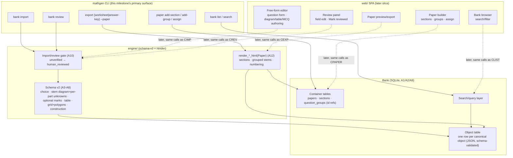

# Question Editor + Persistent Bank — Shaping

> **Where this sits:** the problem space is the empirical work in
> [`SCHEMA-FIT.md`](SCHEMA-FIT.md) and [`PARAMETERIZATION.md`](PARAMETERIZATION.md)
> — 19 gaps found by running three real 2025 P6 prelim papers through the
> canonical schema, and a companion pass asking how much of that same paper the
> engine could *generate*. [`README.md`](README.md) records the decisions already
> made before this doc: local-first single-user persistence, both authoring paths
> with free-form first, and the owner as first user. This doc formalizes the
> requirements as a negotiated **R set**, records the shape as **Shape A**
> (mostly a confirming exercise — the architecture was largely decided upstream,
> with three open threads resolved in this session), and runs the **fit check**.
> From here we breadboard **A** into affordances and slice it
> ([`SLICES.md`](SLICES.md)).

> **Ground-truth sources:** [`README.md`](README.md), [`SCHEMA-FIT.md`](SCHEMA-FIT.md),
> [`PARAMETERIZATION.md`](PARAMETERIZATION.md), `docs/SCHEMA.md`, `docs/DIFFICULTY.md`,
> `docs/planning/mvp/SHAPING.md` (the format and depth this mirrors), `docs/adr/0001–0016`
> (the MVP decisions this initiative builds on), `docs/adr/0017–0020` (new, from this
> session).

---

## Frame

- **Source:** the owner's shaping brief for this session (`README.md`'s open design
  threads) plus the three-paper empirical exercise in `SCHEMA-FIT.md` /
  `PARAMETERIZATION.md`.
- **Problem:** the MVP engine generates trustworthy questions for six blueprint
  families, but a real P6 prelim paper needs about 22 families and has 36% of its
  content in shapes the schema can't hold at all (MCQ, tables, construction
  answers, shared stems across numbered questions). The owner — recreating real
  papers by hand from a PDF bank — has no durable place to save that work and no
  way to author anything the engine doesn't generate. Every session starts from
  zero.
- **Outcome:** the owner can recreate a *whole* real prelim paper — booklets,
  sections, shared-stem question groups, MCQs, tables, grid constructions, and
  the topics the engine already generates — by hand or by generation, save it to
  a durable local bank, and export it as a sectioned worksheet + answer-key PDF
  pair that matches the source paper's structure. The trust distinction between
  engine-proven and human-vouched content stays visible throughout.

---

## Decisions carried in from `README.md` and this session (not re-litigated)

1. **Persistence: local-first, single user.** SQLite + figure blobs on the
   owner's machine, reachable through the engine and CLI. No accounts, no
   hosted state, no auth.
2. **Authoring scope: both paths, free-form first.** The free-form / `sourced` /
   human-vouched path unblocks recreating a real paper now; the parametric path
   stays for topics the engine generates, keeping its correctness proof.
3. **First user is the owner**, recreating questions by hand from a PDF bank.
4. **Paper structure is in scope this milestone** (resolved thread: G15/G16). A
   container above the canonical question object — paper → section → optional
   question group — is built now, not deferred, because it's the only way to
   faithfully recreate a real paper (the stated outcome) and the shared-stem
   pattern is confirmed in all three papers, not speculative.
5. **Schema depth this milestone reaches ranked item 7** (resolved thread): MCQ
   `options`/`choice`, `diagram` on `question` with per-part unknowns, optional
   `marks`/`marking_scheme`, `table`, `grid`+`polygons` on `geometry_figure`, and
   `construction` answers. Items 8+ (symbolic/algebraic answers, compound
   quantities, charts, solids, multi-panel figures) stay on `raster`/`text` and
   are out of scope.
6. **KAN-163 (bank retrieval on swap) stays parked** (resolved thread). The bank
   this milestone builds is a save/search/reuse store; `make-harder`/`make-easier`
   behave exactly as in the MVP. Revisit once the bank has real content to
   retrieve from.
7. **Import needs a review step, not a silent conversion** (G19). Every real
   answer key examined contained errors, so this is a requirement, not a
   nice-to-have.

---

## Requirements (R)

Statuses: **Core goal** · **Must-have** · **Nice-to-have** · **Out** · **Undecided**.
R states *what's needed*; whether the shape satisfies it is shown in the Fit Check.

### R0 — Core goal · *Core goal*

Local-first editor + durable bank (SQLite, single user, no auth) that lets the
owner recreate a whole real P6 prelim paper — booklets/sections, shared-stem
question groups, MCQ, tables, grid constructions, and generated topics — by hand
or by generation, with the trust distinction (`source_type`, `created_by`)
visible throughout, and a mandatory review step before any sourced content is
treated as trustworthy.

### R1 — Bank & persistence

| ID | Requirement | Status |
|----|-------------|--------|
| R1.1 | A durable local SQLite bank + figure storage; no accounts/auth/hosted state | Must-have |
| R1.2 | Bank stores generated *and* sourced objects, both schema-validated on write and read | Must-have |
| R1.3 | Bank stores the new paper/section/group container alongside individual questions | Must-have |
| R1.4 | Search/browse the bank by topic, difficulty, level, `source_type`, paper, and reviewed-status | Must-have |
| R1.5 | Bank is reached through one shared implementation — CLI and (later) the web editor use the same code, not parallel ones | Must-have |
| R1.6 | Backup is copying the file | Must-have |

### R2 — Authoring: free-form / sourced path (comes first)

| ID | Requirement | Status |
|----|-------------|--------|
| R2.1 | Author any question — stem, parts, answer, marking scheme, solution steps — by hand, schema-validated on save | Must-have |
| R2.2 | Raster figure embed (self-contained `data:` URI) as the general figure escape hatch | Must-have |
| R2.3 | Author MCQ: `options[]` with text and/or diagram entries, correct option marked | Must-have |
| R2.4 | Author a table (as content, not a diagram) with a blank/answerable cell | Must-have |
| R2.5 | Author a construction answer — an answer that is itself a diagram, drawn on a grid | Must-have |
| R2.6 | Author a grid background + polygons on `geometry_figure` (coordinate grids, nets, rod patterns) | Must-have |
| R2.7 | Author a stem-level (shared) diagram with multiple unknowns, each bound to a specific part | Must-have |
| R2.8 | `marks` / `marking_scheme` are optional per part — never fabricated when the source paper doesn't supply them | Must-have |

### R3 — Authoring: paper / section / question-group structure

| ID | Requirement | Status |
|----|-------------|--------|
| R3.1 | A **paper** container: title, its sections, aggregate total marks | Must-have |
| R3.2 | A **section** container (e.g. Booklet A/B, Paper 2): its own instructions and answer convention (MCQ vs written) | Must-have |
| R3.3 | A **question group**: an optional shared stem/figure spanning 2+ numbered questions | Must-have |
| R3.4 | Paper-level question numbering is independent of internal object ids | Must-have |
| R3.5 | Export reflects section + group structure (section headers/instructions; a shared stem/figure prints once per group) | Must-have |

### R4 — Authoring: parametric path stays

| ID | Requirement | Status |
|----|-------------|--------|
| R4.1 | Generate from the existing (and future) blueprint families exactly as the MVP does | Must-have |
| R4.2 | Mixed papers — generated + sourced questions side by side — with the trust distinction visibly rendered | Must-have |

### R5 — Import & review gate (G19)

| ID | Requirement | Status |
|----|-------------|--------|
| R5.1 | Imported/authored sourced content lands as `source_type:"sourced"`, `validation.status:"unverified"` | Must-have |
| R5.2 | A mandatory review action — edit any field, then mark `checks.human_reviewed:true` — before content counts as reviewed | Must-have |
| R5.3 | The reviewer can hand-correct any field, including a wrong printed answer key | Must-have |
| R5.4 | The bank distinguishes reviewed vs unreviewed content in search/browse, and flags (not blocks) adding unreviewed content to a paper | Must-have |

### R6 — Editor surface

| ID | Requirement | Status |
|----|-------------|--------|
| R6.1 | Free-form and parametric authoring are clearly separated; trust distinction always visible | Must-have |
| R6.2 | Edit any field of a canonical object with schema validation on save (path-pointed errors, as the engine's load gate already gives) | Must-have |
| R6.3 | Diagram authoring for at least: raster upload, `geometry_figure` (incl. grid/construction), table | Must-have |
| R6.4 | Paper/section/group authoring: add a section, add a group, assign existing questions to it | Must-have |

### R7 — Schema evolution (ranked items 1–7)

| ID | Requirement | Status |
|----|-------------|--------|
| R7.1 | `answer.type: "choice"` — `options[]`, entries carrying text and/or a diagram, correct label | Must-have |
| R7.2 | `diagram` allowed on `question` (stem-level); unknowns in a shared figure bound to individual parts | Must-have |
| R7.3 | `marks` / `marking_scheme` become optional on `part` | Must-have |
| R7.4 | A `table` type — content-level, cells that may be blank/answerable | Must-have |
| R7.5 | `grid` background + `polygons[]` on `geometry_figure` | Must-have |
| R7.6 | `construction` answer — an answer that is a diagram | Must-have |
| R7.7 | All additions are additive (no breaking change to existing v1.4.0 objects); schema version bumps, no migration needed | Must-have |

### R8 — Architecture & scope constraints

| ID | Requirement | Status |
|----|-------------|--------|
| R8.1 | Engine stays UI/HTTP-agnostic; bank reached through engine + CLI, same as the MVP's layering discipline | Must-have |
| R8.2 | Single-user, local-first, no accounts/tenancy (unchanged from `README.md`) | Must-have |
| R8.3 | KAN-163 (bank retrieval on `make-harder`/`make-easier`) is explicitly **out** this milestone | Out |
| R8.4 | Excluded: multi-user/hosted bank; the extraction tooling itself (stays an external LLM step per `SCHEMA-FIT.md`'s "Getting a paper in"); schema items ranked 8+ (symbolic/algebraic answers, compound quantities, time-of-day, direction, charts, solids, multi-panel figures) | Out |
| R8.5 | **Acceptance:** recreate one full real prelim paper — all 47 questions, its sections, and both shared-stem groups — in the bank, exported as a sectioned worksheet + answer-key PDF pair | Must-have |

---

## Shape A — Local bank on the canonical-object seam, container above it, schema grown through the confirmed cluster

Mostly a confirming shape: `README.md` already decided persistence model,
authoring scope, and first user; this session resolved paper-structure scope,
schema depth, and KAN-163. Parts are vertical slices co-locating mechanism with
the data it owns.

| Part | Mechanism |
|------|-----------|
| **A1** | **Bank & canonical persistence** — single-file SQLite bank; one row per canonical object, stored as the same JSON the engine already validates (schema-checked on write *and* read, so the bank can never hold an invalid object); figures stay self-contained `data:` URIs inside the object (no second blob-storage mechanism — matches the V7 `raster` precedent); reachable from `engine`/CLI directly. *(R1.1, R1.2, R1.6, R8.1)* |
| **A2** | **Bank search/browse** — query by `topic`/`difficulty`/`level`/`source_type`/paper-id/reviewed-status; one query layer shared by CLI and the later web editor. *(R1.4, R1.5)* |
| **A3** | **Schema v2 — `choice` answers** — `options[]` (text and/or diagram entries) + correct-label; MCQ render branch (Python + TS mirror). *(R2.3, R7.1)* |
| **A4** | **Schema v2 — stem-level diagram** — `diagram` allowed on `question`; each `unknown` in `angles[]`/equivalent binds to a specific `part.label`, fixing G5; diagram-consistency check updated to resolve per-part. *(R2.7, R7.2)* |
| **A5** | **Schema v2 — optional marking fields** — `marks`/`marking_scheme` become optional on `part`; worksheet renderer omits `[n]` when absent instead of fabricating a value. *(R2.8, R7.3)* |
| **A6** | **Schema v2 — `table` type** — a content-level type (sibling of `stem`, not a `diagram` variant, per PARAMETERIZATION's read); cells may be blank and answerable; renders as a real `<table>` in worksheet/answer-key HTML. *(R2.4, R7.4)* |
| **A7** | **Schema v2 — grid + polygons** — optional `grid` background and `polygons[]` region list on `geometry_figure`; absorbs coordinate grids, nets, and rod-pattern figures without new diagram types. *(R2.6, R7.5)* |
| **A8** | **Schema v2 — `construction` answer** — an answer variant whose value is itself a diagram (built on A7's grid); the answer-key renderer gets a branch that renders a figure, not a value, where this type is used. *(R2.5, R7.6)* |
| **A9** | **Paper/section/question-group container** — `Paper { title, sections[] }` → `Section { label, instructions, answer_convention, members[] }` → optional `QuestionGroup { shared_stem?, shared_diagram?, question_ids[] }`; **members reference existing question ids, they don't duplicate content into them** — this is the resolved answer to G16 (see Component A9 below). Stored in the bank alongside (not inside) individual canonical objects. *(R3.1–R3.4)* |
| **A10** | **Import & review gate** — sourced content lands `validation.status:"unverified"`; a review action lets any field be hand-corrected before flipping `checks.human_reviewed:true`; bank search/browse and paper-assembly both surface reviewed-vs-not, flagging (never blocking) unreviewed use. *(R5.1–R5.4)* |
| **A11** | **Free-form authoring surface** — CLI-first for this milestone: `mathgen bank import <file.json>` / `mathgen bank review <id>` validate through the same load gate as generation and report path-pointed errors; a web visual editor (forms + in-browser figure/table/grid authoring) is a later slice on the identical bank and schema. Parametric authoring (existing Generate panel + `mathgen generate`) is untouched and stays visually distinct. *(R2.1–R2.2, R4.1–R4.2, R6.1–R6.3)* |
| **A12** | **Grouped export** — `render_worksheet_html`/`render_answer_key_html` accept a `Paper` (not just a flat question list): prints section headers/instructions, renders a shared stem/figure once per group, keeps paper-level numbering. *(R3.5, R6.4)* |
| **A13** | **Delivery** — bank + schema v2 live in `engine/`; `mathgen bank {import,list,search,review}` subcommands; API/web wiring for the visual editor and grouped-paper UI is deferred to its own later slice, per A11's sequencing. *(R8.1)* |

No parts are flagged ⚠️ — every mechanism above is concretely specified.

### Component A9 — how the group container relates to the question object

The one genuinely open mechanism this session surfaced (from G16). Two ways to
bind shared stem/figure content to member questions:

| Req | Requirement | A9-A: container references, no duplication | A9-B: shared content copied into every member object |
|-----|-------------|:---:|:---:|
| — | Editing the shared stem/figure updates every member consistently | ✅ | ❌ |
| — | A member question stays valid and reusable standalone (outside its group) | ✅ | ✅ |
| — | No schema change to the canonical object itself | ✅ | ❌ (needs a `group_id`/shared-content field on `question`) |

**A9-A wins outright** — it's exactly what G16 warned against: *"Duplicating the
table into both objects makes them silently coupled — edit one and the paper
becomes inconsistent."* A9-A also needs no canonical-schema change at all; the
group is pure bank/container structure. **Decision: A9-A**, folded into A9 above.

---

## Fit Check — R × A (selected shape)

| Req | Requirement | Status | A |
|-----|-------------|--------|:-:|
| R1.1 | Local SQLite bank, no accounts | Must-have | ✅ |
| R1.2 | Bank stores generated + sourced, schema-validated both ways | Must-have | ✅ |
| R1.3 | Bank stores paper/section/group container | Must-have | ✅ |
| R1.4 | Search/browse by topic/difficulty/level/source_type/paper/reviewed | Must-have | ✅ |
| R1.5 | One shared bank implementation (CLI + later editor) | Must-have | ✅ |
| R1.6 | Backup = copy the file | Must-have | ✅ |
| R2.1 | Author any question by hand, schema-validated | Must-have | ✅ |
| R2.2 | Raster figure embed | Must-have | ✅ |
| R2.3 | Author MCQ (`options[]`, text/diagram entries) | Must-have | ✅ |
| R2.4 | Author a table with a blank/answerable cell | Must-have | ✅ |
| R2.5 | Author a construction answer on a grid | Must-have | ✅ |
| R2.6 | Author grid + polygons on `geometry_figure` | Must-have | ✅ |
| R2.7 | Stem-level diagram, unknowns bound per part | Must-have | ✅ |
| R2.8 | Marks/marking_scheme optional per part | Must-have | ✅ |
| R3.1 | Paper container | Must-have | ✅ |
| R3.2 | Section container w/ own instructions | Must-have | ✅ |
| R3.3 | Question group w/ shared stem/figure | Must-have | ✅ |
| R3.4 | Paper-level numbering independent of object ids | Must-have | ✅ |
| R3.5 | Export reflects section + group structure | Must-have | ✅ |
| R4.1 | Generate from existing blueprint families | Must-have | ✅ |
| R4.2 | Mixed papers, trust distinction visible | Must-have | ✅ |
| R5.1 | Sourced content lands unverified | Must-have | ✅ |
| R5.2 | Mandatory review action before trusted | Must-have | ✅ |
| R5.3 | Reviewer can hand-correct any field | Must-have | ✅ |
| R5.4 | Bank distinguishes reviewed/unreviewed; flags not blocks | Must-have | ✅ |
| R6.1 | Free-form/parametric clearly separated | Must-have | ✅ |
| R6.2 | Edit any field, schema-validated on save | Must-have | ✅ |
| R6.3 | Diagram authoring: raster, geometry_figure+grid+construction, table | Must-have | ✅ |
| R6.4 | Paper/section/group authoring UI | Must-have | ✅ |
| R7.1 | `choice` answers | Must-have | ✅ |
| R7.2 | `diagram` on `question`, unknowns bound to parts | Must-have | ✅ |
| R7.3 | Marks/marking_scheme optional | Must-have | ✅ |
| R7.4 | `table` type | Must-have | ✅ |
| R7.5 | Grid + polygons on `geometry_figure` | Must-have | ✅ |
| R7.6 | `construction` answer | Must-have | ✅ |
| R7.7 | Additive-only, no migration | Must-have | ✅ |
| R8.1 | Engine UI/HTTP-agnostic; bank via engine + CLI | Must-have | ✅ |
| R8.2 | Single-user, local-first, no accounts | Must-have | ✅ |
| R8.3 | KAN-163 out this milestone | Out | ✅ |
| R8.4 | Excluded scope stays excluded | Out | ✅ |
| R8.5 | Acceptance: recreate one full paper, sectioned export | Must-have | ✅ |

**Notes:**
- Every requirement is satisfied by a named mechanism; there is no accepted gap
  to record (unlike the MVP's R6.4, which was deferred there and stays parked
  here by explicit decision — R8.3).
- **R6.4's UI portion and A11's web editor are real work not yet detailed** — the
  fit check passes because A11 names a concrete two-stage mechanism (CLI-first,
  web editor later), not because the web UI is built. The breadboard below
  sketches both stages; slicing will make the boundary between them explicit.

**Unsolved after selection:** none blocking. Shape A is ready to **breadboard**.

---

## Detail A — Breadboard

Concrete affordances for Shape A. **The affordance tables are the source of
truth; the diagram renders them.** *Place* = a screen, panel, CLI surface, or
code module. Shape-part tags (A1…A13) tie each affordance back to the parts.
UI affordances marked *(web, later slice)* exist as CLI/file affordances in the
milestone's early slices and gain a visual UI in a later one — see `SLICES.md`.

### UI Affordances

| Place | Affordance | Wires Out | Part |
|-------|-----------|-----------|:----:|
| **Free-form editor** *(web, later slice)* | Question form (stem, parts, answer-type picker, marks) | → validates against schema → save to bank | A11 |
| **Free-form editor** *(web, later slice)* | Diagram authoring (raster upload / `geometry_figure` incl. grid+construction / table builder) | → attaches to `question`/`part` | A3, A6, A7, A8, A11 |
| **Free-form editor** *(web, later slice)* | MCQ options editor (add option, mark correct, per-option text or diagram) | → `answer.type:"choice"` | A3, A11 |
| **Review panel** *(web, later slice)* | Field-by-field correction view for an imported object | → edits object; **Mark reviewed** button flips `checks.human_reviewed` | A10 |
| **Bank browser** *(web, later slice)* | Search/filter by topic, difficulty, level, source_type, paper, reviewed status | ← `bank.search()` | A2 |
| **Paper builder** *(web, later slice)* | Add section / add question group / assign existing questions | → mutates `Paper` container | A9, A12 |
| **Paper builder** *(web, later slice)* | **Preview** / **Export worksheet** / **Export answer-key** (sectioned) | → `render_*_html(Paper)` → PDF exporter | A12 |
| **CLI** (`mathgen bank`) | `import <file.json>` | → schema-validate → insert row; reports path-pointed errors on failure | A1, A11 |
| **CLI** | `list` / `search --topic --difficulty --source-type --paper --reviewed` | ← `bank.search()` | A2 |
| **CLI** | `review <id>` (opens object for hand-edit, then `--mark-reviewed`) | → A10's review action, file-based | A10, A11 |
| **CLI** | `paper add-section` / `add-group` / `assign` | → mutates `Paper` container from the CLI | A9 |
| **CLI** | `export {worksheet,answer-key} --paper <id>` | → `render_*_html(Paper)` → PDF | A12 |

### Non-UI Affordances

| Place | Affordance | Wires Out | Part |
|-------|-----------|-----------|:----:|
| **Bank** (`engine`, SQLite) | Object table: one row per canonical object (JSON blob), schema-validated on write and read | ← `canonical.load`/`validate` | A1 |
| **Bank** | Container tables: `papers`, `sections`, `question_groups` (references by id, no content duplication) | → A9 mechanism | A9 |
| **Bank** | Search/query layer | ← indexed columns: topic, difficulty, level, source_type, paper_id, reviewed | A2 |
| **Engine — schema** (A3–A8) | `answer.type:"choice"` sub-schema + validator | A3 | |
| **Engine — schema** | `question.diagram` (optional) + per-part unknown binding | A4 | |
| **Engine — schema** | `part.marks`/`marking_scheme` made optional | A5 | |
| **Engine — schema** | `table` type sibling to `stem` | A6 | |
| **Engine — schema** | `geometry_figure.grid` + `.polygons[]` | A7 | |
| **Engine — schema** | `answer.type:"construction"` sub-schema | A8 | |
| **Engine — diagram** | Consistency check updated: resolve per-part unknowns against a shared stem-level figure | ← A4 | |
| **Engine — render** | Table renderer (`<table>` from `table` content) | ← A6 | |
| **Engine — render** | MCQ option renderer (text and/or diagram entries) | ← A3 | |
| **Engine — render** | Construction-answer renderer (renders a figure in the answer key) | ← A8 | |
| **Engine — render** | `render_*_html(Paper)` — section headers, grouped shared stem/figure once per group, paper-level numbering | ← A9 | A12 |
| **Engine — import** | Load gate stamps `validation.status:"unverified"` on any freshly-authored/imported sourced object | → A10 | |
| **Engine — import** | Review action: arbitrary field edit + `checks.human_reviewed:true` flip, re-validated | → A10 | |
| **CLI** (`mathgen`, A11/A13) | `bank import` / `bank list` / `bank search` / `bank review` / `paper add-section` / `paper add-group` / `paper assign` / `export {worksheet,answer-key} --paper` | → calls bank + engine directly | A13 |
| **API/web** *(later slice)* | `POST /bank/*`, `POST /paper/*` thin wrappers over the same bank/engine calls the CLI uses | → A13 | |

### Wiring diagram

**Orthogonal concerns the breadboard reveals:**
- **Schema v2 (A3–A8) is independent of the container (A9)** — MCQ, tables,
  grids/construction all land on individual canonical objects and are usable
  stand-alone; the paper/section/group container is a pure wrapper that
  references objects by id. Either can slip without blocking the other.
- **The CLI-vs-web boundary is a sequencing choice, not an architecture split** —
  every CLI affordance above is a thin call over the same bank/engine functions
  a web form will call later, so the web editor is additive UI, not a rewrite.
- **The review gate (A10) sits between import and the schema, not after it** —
  an object is schema-valid *and* unreviewed at the same time; those are
  orthogonal (`validation.status` vs `checks.human_reviewed`), which is why
  flagging rather than blocking unreviewed content in a paper (R5.4) is
  consistent rather than a special case.
