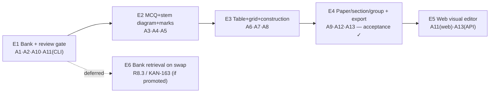

# Question Editor + Persistent Bank — Slices

> **Implementation plan** for Shape A (see `SHAPING.md` for R, Shape A parts,
> fit check, and the breadboard this slices). Each slice is a **vertical
> increment** and **ends in demo-able output** — CLI output counts, following
> the MVP's own V7 precedent (`mathgen` proved the engine end-to-end with no web
> app). Numbered **E1…E5** (Editor) to stay distinct from the MVP's **V1…V7**.
> Order follows the resolved sequencing: **bank + review gate first** (nothing
> else is safe to build on top of), **then** the confirmed schema cluster
> (MCQ → stem-diagram → marks, then table → grid → construction as one
> cluster), **then** the container that ties everything into a whole paper, and
> **only then** a visual web UI over the same bank/schema both CLI slices
> already exercise.
>
> **Consistency:** slices reference Shape-A parts (A1…A13) and requirements
> (R1…R8). A change to a slice's scope must ripple up to `SHAPING.md`.

---

## Slice map

| Slice | Title | Ends in (demo) | Parts | Reqs |
|-------|-------|----------------|-------|------|
| **E1** | Bank + review gate (CLI, schema unchanged) | `mathgen bank import`/`list`/`search`/`review` persist a hand-authored sourced question across invocations, unverified until reviewed | A1, A2, A10, A11 (CLI stage) | R1.1–R1.2, R1.4–R1.6, R5.1–R5.4, R6.2, R8.1–R8.2 |
| **E2** | Schema v2 — MCQ, stem diagram, optional marks | Import an MCQ with diagram options and a two-part question sharing one stem-level figure with per-part unknowns; both render correctly | A3, A4, A5 | R2.3, R2.7–R2.8, R7.1–R7.3, R7.7 |
| **E3** | Schema v2 — table, grid, construction | Import a table-with-blank-cell question and a "draw on this grid" construction question; both render (real `<table>`, figure-valued answer) | A6, A7, A8 | R2.4–R2.6, R7.4–R7.6 |
| **E4** | Paper/section/group container + grouped export | Assemble one full real prelim paper (47 questions, 3 sections, 2 shared-stem groups) from bank content and export a sectioned worksheet + answer-key PDF pair ⇒ **milestone acceptance** | A9, A12, A13 | R3.1–R3.5, R8.5 |
| **E5** | Web visual editor | Author an MCQ/table/construction/group question through web forms (no hand-written JSON), saved to the same bank; build a paper through a Paper-builder UI | A11 (web stage), A13 (API wiring) | R6.1–R6.4, R1.5 |

**Not sliced (deferred):** **R8.3** — bank retrieval on `make-harder`/`make-easier`
(KAN-163). Explicitly out this milestone (decided in `SHAPING.md`). Add a slice
E6 if it's promoted back in once the bank has real content.

---

## E1 — Bank + review gate (CLI, schema unchanged)

> **Plan:** [`E1-plan.md`](E1-plan.md) — SQLite bank (`engine/exam_engine/bank.py`,
> stdlib `sqlite3`, no new dependency), `mathgen bank
> {import,list,search,review}`, and the review-gate semantics (ADR-0019).

**Goal:** a durable place to put sourced questions and a real review step —
before touching the schema at all, so the persistence spine is proven against
content the engine already accepts (V7's sourced path).

**Affordances (subset of Detail A):**
- CLI: `mathgen bank import <file.json>` (schema-validates through the existing
  load gate, stamps `validation.status:"unverified"`, inserts a row); `mathgen
  bank list`; `mathgen bank search --topic --difficulty --level --source-type
  --reviewed`; `mathgen bank review <id>` (opens the object for a field edit,
  `--mark-reviewed` flips `checks.human_reviewed`).
- Non-UI: SQLite bank (`engine/exam_engine/bank.py` or similar) — one row per
  canonical object, the same JSON the engine already validates; indexed columns
  for search.

**Build:**
1. **A1** SQLite bank: schema-validate on write *and* read; figures stay
   self-contained `data:` URIs inside the stored object (no second blob table).
2. **A2** minimal search/query layer over the indexed columns.
3. **A10** import/review gate: stamp `unverified` on write; review action
   re-validates after a hand edit, then flips `human_reviewed`.
4. **A11** (CLI stage only) `bank import`/`list`/`search`/`review` subcommands.

**Demo / acceptance:** import a hand-authored sourced question (existing
schema — e.g. the V7 fixture shape), see it listed as unreviewed; edit a field
and mark it reviewed; `search --reviewed=false` and `--reviewed=true` return the
right sets; close the CLI and reopen — the object is still there.

## E2 — Schema v2: MCQ, stem diagram, optional marks

**Goal:** unblock the largest single question count (45 MCQs across the three
papers) and the shared-figure structured questions, at the lowest schema risk —
the three changes stable across all three papers.

**Affordances:** `bank import` now accepts `answer.type:"choice"` (options with
text and/or a diagram, correct label) and a stem-level `question.diagram` with
per-part unknowns; a part with no `marks`/`marking_scheme` validates.

**Build:** **A3** `choice` sub-schema + MCQ render branch (Python + TS mirror);
**A4** `diagram` allowed on `question`, unknown-binding to `part.label`, updated
diagram-consistency check; **A5** `marks`/`marking_scheme` optional on `part`,
worksheet renderer omits `[n]` when absent.

**Demo / acceptance:** import P1 Q8-shaped MCQ (four candidate nets as diagram
options) → renders with lettered options, correct one marked in the answer key;
import a two-part question sharing one stem figure where part (a) asks for
∠LOK and part (b) for ∠LNM → both resolve against the single figure; import a
question with a part carrying no mark allocation → validates and renders
without a fabricated `[n]`.

## E3 — Schema v2: table, grid, construction

**Goal:** the newly-promoted cluster — tables (2nd most common figure kind,
sometimes the answer surface), grid backgrounds (the substrate for nets and
patterns), and construction answers (every one of them a drawing on a grid).

**Affordances:** `bank import` now accepts a `table` (content-level, blank
cells allowed), a `grid` background + `polygons[]` on `geometry_figure`, and
`answer.type:"construction"` (an answer that is itself a diagram).

**Build:** **A6** `table` type + real `<table>` renderer; **A7** `grid` +
`polygons[]` on `geometry_figure`; **A8** `construction` answer sub-schema +
answer-key renderer branch that draws a figure instead of printing a value.

**Demo / acceptance:** import the water-tariff table (FIG-18-shaped, blank
answer cell) → renders as a real table in the worksheet and the filled value in
the answer key; import a "complete the parallelogram and label point D"
question on a square grid → validates, and the answer key renders the
completed figure; import a cube-net question using the grid+polygons
substrate.

## E4 — Paper/section/group container + grouped export

**Goal:** tie individually-authored/generated questions into a whole real
paper — the milestone's stated outcome.

**Affordances:** `mathgen paper add-section` / `add-group` / `assign`; `mathgen
export {worksheet,answer-key} --paper <id>` producing one sectioned PDF pair.

**Build:** **A9** `Paper → Section → optional QuestionGroup` container in the
bank, referencing existing question ids (no content duplication — Component
A9-A from `SHAPING.md`); **A12** `render_*_html(Paper)`: section headers +
instructions, a shared stem/figure printed once per group, paper-level
numbering independent of object ids; **A13** the CLI `paper` subcommands.

**Demo / acceptance (milestone acceptance, R8.5):** using E1–E3's import path,
load all 47 questions of one real prelim paper into the bank; assemble Booklet
A, Booklet B, and Paper 2 as sections, with the two confirmed shared-stem pairs
(Q9/Q10, Q21/Q22) as question groups; export a worksheet PDF and a separate
answer-key PDF that both mirror the source paper's section structure and
numbering.

## E5 — Web visual editor

**Goal:** replace hand-written JSON with forms, for daily use — without
changing the bank or schema underneath.

**Affordances:** question form (stem/parts/answer-type/marks); diagram
authoring (raster upload, `geometry_figure` incl. grid+construction, table
builder); MCQ options editor; review panel (field-by-field correction +
**Mark reviewed**); bank browser (search/filter); Paper builder (add
section/group, assign questions); preview + export buttons.

**Build:** **A11** (web stage) — Svelte forms and figure/table authoring
components over the *same* bank/engine calls E1–E4's CLI already uses; **A13**
thin API wrappers (`POST /bank/*`, `POST /paper/*`) mirroring the CLI
one-for-one, proving R1.5 (one shared implementation) rather than a parallel
one.

**Demo / acceptance:** author a new MCQ question with a diagram option, a table
question, and a construction question entirely through the browser, with no
hand-written JSON; the objects are indistinguishable in the bank from ones
`mathgen bank import` produced; build a second paper's section/group structure
through the Paper builder and export it.

---

## Sliced breadboard (build order overlay)

E1–E4 are a strict chain: each schema/container addition is validated against
real paper content accumulated by the prior slice, and E4's acceptance demo
needs every question shape E1–E3 unlocked. **E5 depends only on E4** (it needs
a stable bank, schema, and container to build forms over) and could in
principle start once E1 lands, if UI work is wanted in parallel — but building
it last keeps the CLI as the single source of truth for "does this affordance
work at all" until the very end, matching the MVP's own engine-before-UI
discipline (ADR-0001).
