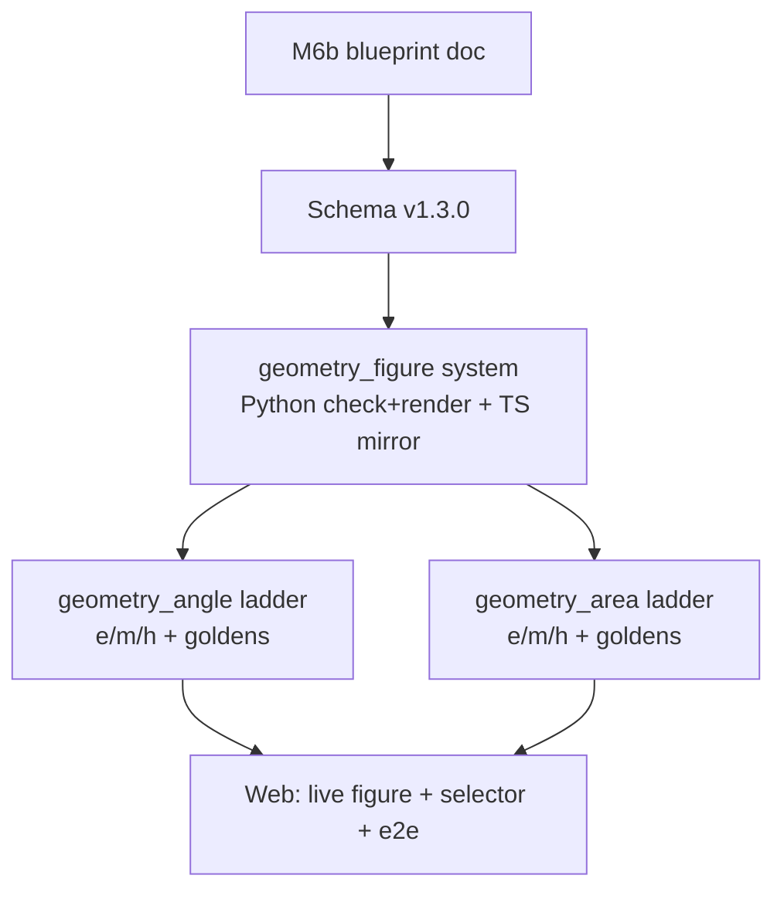

# V6b Blueprint — PSLE geometry figures (angle + area ladders)

> **Extension of Slice V6** (`docs/planning/mvp/SLICES.md`, part **A5** diagram
> spec+check+render, part **A10** content). This is the product blueprint for the
> *rich* geometry work shaped with the product owner on 2026-07-17: syllabus-aligned
> P5–P6 **figure geometry** — unknown angles, area/perimeter of composite figures
> (including circles), shaded area, and unknown length from an area/perimeter
> relationship. It **supersedes** the two simpler axis-aligned geometry families
> (`composite_geometry`, `area_perimeter`) that the parent `V6-plan.md` sketched;
> `shaded_fraction` is retained solely as the Fractions-easy mandatory figure (D1).
>
> **Syllabus ground truth:** `docs/syllabus/primary_mathematics_syllabus_2021_updated_oct_2025_llm.md`
> (P5 Measurement & Geometry; P6 Measurement & Geometry). Every archetype below is
> traced to a specific syllabus clause in **§Syllabus grounding**. Difficulty model:
> `docs/DIFFICULTY.md` (the named levers). Diagram policy (mandatory vs aid):
> **ADR-0007**; diagram union: **ADR-0012**; consistency + schema versioning:
> **ADR-0014**. Blueprint = YAML + named solver: **ADR-0003**; answer key + M/A/B
> marks: **ADR-0005**; engine-purity / JSON-Schema-as-truth: **ADR-0016**.
>
> **Schema contract:** `schemas/canonical-question.schema.json` **v1.2.0 → v1.3.0**
> (see §Schema impact): add one general `geometry_figure` diagram type; **remove**
> the unbuilt `composite_geometry` + `area_perimeter` types; add speed units to the
> `unit` enum (the D3 bump, folded in here). No shipped/golden object uses the
> removed types, so real canonical objects are unaffected.
>
> **Demo goal:** the topic selector offers two new geometry topics — **Geometry
> (Angles)** and **Geometry (Area & Perimeter)** — each a full easy/medium/hard
> ladder. Generating any rung yields a fresh, schema-valid question with a
> **provably-correct** typed answer, per-part `[n]` marks, and an **accurate,
> mandatory (non-toggleable) figure**. make-harder / make-easier walk each ladder;
> the diagram toggle is absent (mandatory-figure family).

---

## Shaping decisions locked (2026-07-17 interview)

| # | Decision | Choice |
|---|----------|--------|
| **G1** | Syllabus scope | **Strictly P5–P6 PSLE Standard.** No O-Level constructs (no angle-chasing inside circles, no tangents/chords, no Pythagoras/trig, no "additional construction of lines"). |
| **G2** | Archetypes in scope | Unknown angle in a composite polygon figure; shaded/total area of a composite figure (incl. circles); perimeter of a composite figure (incl. arcs); unknown length from an area/perimeter relationship. All four verified in-syllabus. |
| **G3** | Generation model | **Curated parametric templates.** A fixed catalogue of figure shapes per rung; only numbers/angles vary per seed. Deterministic, provably correct. Variety = catalogue size. |
| **G4** | π & circle answers | **Auto-select π**: use `22/7` when the radius/diameter is a multiple of 7, else `3.14`; the stem states "Take π = …"; the answer is numeric (exact for the 22/7 path, 2-dp decimal for 3.14). |
| **G5** | Ladder decomposition | **Two ladders:** `geometry_angle_{easy,medium,hard}` and `geometry_area_{easy,medium,hard}` (6 blueprints). "Unknown length" folds into the area ladder as an inverse-direction variant. Own board epic (**M6b**). |
| **G6** | Relationship to simple families | **Supersede.** One coherent `geometry_figure` spec + solver system replaces `composite_geometry` + `area_perimeter`. Keep `shaded_fraction` (Fractions-easy, D1). |
| **G7** | 3D volume (cube/cuboid, isometric) | **Out of scope** for V6b. If wanted later it is a third geometry ladder with its own isometric renderer — not planned here. |

These compose with the parent-plan decisions already confirmed: **D1** (Fractions-easy = `shaded_fraction`), **D3** (accept the speed-unit schema bump — folded into v1.3.0 here), **D5** (change-to-decimals stays money-only, so it is naturally unavailable on geometry).

---

## Syllabus grounding (every archetype traced)

From the 2021 syllabus (updated Oct 2025):

- **Angles (P5 Geometry §1):** angles on a straight line (§1.1), at a point (§1.2),
  vertically opposite (§1.3), finding unknown angles (§1.4).
- **Triangle (P5 Geometry §2):** properties of isosceles / equilateral /
  right-angled (§2.1); angle sum of a triangle (§2.2); **finding unknown angles
  without additional construction of lines** (§2.3).
- **Parallelogram, Rhombus, Trapezium (P5 Geometry §3):** properties (§3.1);
  finding unknown angles without additional construction (§3.2).
- **Special Quadrilaterals (P6 Geometry §1.1):** finding unknown angles, without
  additional construction, in **composite geometric figures involving square,
  rectangle, triangle, parallelogram, rhombus, trapezium**.
- **Area of Triangle (P5 Area §1):** base/height (§1.1–1.2); **area of composite
  figures made up of rectangles, squares and triangles** (§1.3).
- **Area & Circumference of Circle (P6 Area §1):** area/circumference of circle
  (§1.1); area & perimeter of **semicircle and quarter circle** (§1.2); **area and
  perimeter of composite figures made up of square, rectangle, triangle,
  semicircle and quarter circle** (§1.3).

**Hard boundaries the syllabus enforces (and the engine must respect):**

1. **Circles never appear in angle problems.** Angle work is polygon-only
   (straight-edged). Circles appear only in area/perimeter.
2. **"Without additional construction of lines."** Every angle template must be
   solvable directly from the marked figure — no auxiliary lines.
3. **Circle parts are whole / semi / quarter only.** No arbitrary sectors, chords,
   tangents, or inscribed-angle geometry.
4. **Length is recovered arithmetically** (from an area/perimeter formula),
   **never by Pythagoras or trigonometry.**

---

## The two ladders (rung mapping, grounded in `docs/DIFFICULTY.md` levers)

### `geometry_angle_*` — unknown angle in a polygon figure

| Rung | What it tests | Levers pulled | Marks |
|------|---------------|---------------|-------|
| **easy** | One rule, one step: angles on a straight line (=180°), angles at a point (=360°), or angle sum of a triangle (=180°). | reasoning depth (1 step) | 2 |
| **medium** | Two-step chain / property recall: isosceles base-angles equal → apex/base; exterior angle via straight line then angle-sum; vertically-opposite + straight-line combo. | reasoning depth (multi-step), hidden structure (recall equal angles) | 3 |
| **hard** | P6 composite figure: a triangle sharing an edge with a special quadrilateral (parallelogram/rhombus/trapezium); multi-step chain combining two shape properties. | multi-step, hidden structure, cross-property integration | 3 |

Answer: **integer**, unit `degrees`. (No π, no rounding — angle answers are exact integers by construction.)

### `geometry_area_*` — area / perimeter / shaded / unknown length

| Rung | What it tests | Levers pulled | Marks |
|------|---------------|---------------|-------|
| **easy** | Single shape, direct: area of a rectangle/square, or area of a triangle (½·b·h). | reasoning depth (1 step) | 2 |
| **medium** | Composite of polygons (add/subtract rectangles/squares/triangles) for area **or** perimeter; **or** a single circle/semicircle/quarter-circle area or perimeter (π auto-select, G4). | multi-step, representation translation | 3 |
| **hard** | Composite figure combining a polygon with a semicircle/quarter-circle → shaded area or perimeter (with arcs); **or** the inverse — a missing length given the figure's area/perimeter ("unknown length", G2). | inverse direction, hidden structure, π, multi-step | 4 |

Answer: **integer or decimal** (`dp` set when π=3.14 path yields a 2-dp value; exact for the 22/7 path); unit `cm^2` / `m^2` for area, `cm` / `m` for perimeter/length.

> `docs/DIFFICULTY.md` currently has a single "Area/Geometry" row (easy=rectangle
> area, medium=composite add/subtract, hard=overlapping + inverse). **Ripple:** split
> that row into two — `Geometry (Angles)` and `Geometry (Area)` — matching the table
> above (see §Doc-consistency).

---

## Starter template catalogue (proposed — the G3 catalogue)

Each template is a parametric figure: the sampler picks the free numbers/angles
(integers; radii multiples of 7 when the 22/7 π-path is chosen), the solver computes
the answer analytically, and the same numbers drive the rendered figure. Author may
extend the catalogue later (variety = catalogue size).

**`geometry_angle`**
- *easy:* `straight_line_angles` (2–3 angles on a line, one unknown), `angles_at_point` (3–4 rays, one unknown), `triangle_angle_sum` (two angles given, find third).
- *medium:* `isosceles_triangle` (given apex or a base angle, find the other), `exterior_angle_on_line` (triangle with one side extended), `vertically_opposite_plus_line` (an X-crossing with a triangle).
- *hard:* `triangle_on_parallelogram` (triangle sharing an edge with a parallelogram), `triangle_on_trapezium`, `rhombus_with_diagonal_triangle`.

**`geometry_area`**
- *easy:* `rectangle_area`, `square_area`, `triangle_area` (base + perpendicular height labelled).
- *medium:* `L_shape` (add/subtract two rectangles), `rectangle_plus_triangle` (house/arrow), `single_circle` / `semicircle` / `quarter_circle` (area or perimeter).
- *hard:* `square_minus_quarter_circles` (classic shaded region), `rectangle_with_semicircle_ends` (running-track / stadium), `triangle_with_semicircle`, `inverse_rectangle_side` (area given → find width), `inverse_triangle_height` (area + base given → find height).

> Each template names the exact numbers it labels on the figure and the exact
> consistency checks its spec must satisfy — authored alongside the golden fixture.

---

## The `geometry_figure` diagram system (part A5)

**One new `diagram.type`: `geometry_figure`** — a general 2D figure spec covering
both ladders (angle figures use points + segments + angle marks; area figures add
arcs + shaded regions + dimension labels). This replaces the two axis-aligned types
(G6) with a single coherent system, following `diagram.py`'s existing
two-function contract dispatched on `spec["type"]`.

**Proposed spec shape** (final field set authored with the schema PR):

```jsonc
{
  "type": "geometry_figure",
  "unit": "cm",                 // for length/area labels; angles are unitless degrees
  "points":   [ { "id": "A", "x": 0,  "y": 0 }, ... ],   // named vertices, figure coords
  "segments": [ { "from": "A", "to": "B", "label": "8 cm", "ticks": 1 }, ... ],
  "arcs":     [ { "center": "O", "radius": 7, "start_deg": 0, "end_deg": 90, "label": null }, ... ],
  "angles":   [ { "at": "B", "from": "A", "to": "C", "value_deg": 50, "unknown": false, "right": false }, ... ],
  "shaded":   [ { "boundary": ["A","B","C"], "arcs": [] } ],   // region(s) to fill
  "labels":   [ { "at": "P", "text": "x" } ]                    // free labels
}
```

- **`check_geometry_figure_consistency(spec, params, solution)`** (called by the
  pipeline, R3.3) → per-check boolean map. Asserts **every labelled value equals its
  param/solved counterpart** (each `segment.label` length == the param; each
  `arc.radius` == the param; each `angle.value_deg` == the given param; the one
  `angle` with `"unknown": true` == the solved answer; the shaded region matches the
  solved region). Plus a **degeneracy guard** (positive lengths; angles in
  `(0,180)`; triangle inequality where relevant). A deterministic figure built from
  correct values is always consistent — a `False` means an engine bug and raises
  `DiagramInconsistent` (surfaced loudly, ADR-0014).
- **`render_svg` → `_render_geometry_figure(spec)`**: a self-contained inline
  `<svg>` (explicit `viewBox`; segments as polylines; arcs via SVG `A` path
  commands; angle marks as small arcs + a right-angle square; equal-side tick marks;
  shaded regions as filled paths; text labels). Coordinates are **floats scaled into
  a fixed viewBox** — still fully deterministic (same spec → byte-identical SVG); the
  integer-coordinate discipline of the bar-model renderers is relaxed here because a
  general figure needs real geometry, but **labelled values remain exact** (they come
  from params, not from measuring the drawing).
- **Client mirror (real work, mirrors the bar-model precedent).** The live review
  card renders the spec client-side via `web/src/lib/barModel.ts` (which returns `''`
  for unknown types → a geometry card would show *no figure*, unacceptable for a
  mandatory family). So `geometry_figure` needs a **TypeScript mirror renderer**
  (`renderGeometryFigure`, likely in a new `web/src/lib/geometry.ts`, with the
  `DiagramSpec` union widened) that reproduces `_render_geometry_figure` — exactly as
  `renderBarModelBeforeAfter` mirrors `_render_bar_model_before_after`. This is the
  single largest piece of V6b and the reason the diagram-system card is 5 pts.

---

## Schema impact (v1.2.0 → v1.3.0)

Additive-to-real-data (no shipped/golden object uses the removed types):

1. **Add** `$defs/diagram_geometry_figure` and reference it in the `diagram` `oneOf`.
2. **Remove** `$defs/diagram_composite_geometry` and `$defs/diagram_area_perimeter`
   from `$defs` and the `oneOf` (superseded, never built — G6).
3. **Keep** `diagram_shaded_fraction` (Fractions-easy, D1), `diagram_bar_model`,
   `diagram_bar_model_before_after`, `diagram_raster`.
4. **Add speed units** to the `unit` enum: `km/h`, `m/s`, `m/min` (the D3 bump for
   the Speed ladder — folded in here so there is a single v1.3.0).
5. `degrees`, `cm^2`, `m^2`, `cm`, `m` are already in the `unit` enum — angle and
   area/length answers need **no** new units.

Ripple: `docs/SCHEMA.md` (document `geometry_figure`; note the two removals) and any
schema-version string the docs track.

---

## Determinism & provable correctness (why the answer key is trustworthy)

- **Angle ladder:** the sampler chooses the *given* angles as integers and the
  template; the solver derives the unknown purely by the exact angle rules
  (sum-to-180/360, equal base angles, etc.). Integer in → integer out, no floating
  point. The figure is drawn from those same integers.
- **Area ladder:** the sampler chooses integer dimensions (radii multiples of 7 on
  the 22/7 path); the solver computes areas/perimeters by exact formulas, carrying
  π as the rational `22/7` (exact) or the decimal `3.14` (fixed), and rounds only at
  the final presentation step with an explicit `dp`. The stem prints the π value
  used (G4).
- **No LLM** anywhere — mathematical truth is the deterministic solver, so the
  printed key is provably the solution to the printed figure (project invariant).
- **`validate` per blueprint** re-checks the solved answer against an independent
  recomputation before assembly (the ratio-solver precedent).

---

## Files touched (real paths)

```
schemas/canonical-question.schema.json          # + geometry_figure, − composite/area_perimeter, + speed units → v1.3.0
engine/exam_engine/diagram.py                    # + check_geometry_figure_consistency, + _render_geometry_figure; − the two superseded branches (never added)
engine/exam_engine/ladder.py                     # + two ladders: geometry_angle, geometry_area
engine/exam_engine/blueprints/solvers/
  geometry_angle_easy.py  geometry_angle_medium.py  geometry_angle_hard.py
  geometry_area_easy.py   geometry_area_medium.py   geometry_area_hard.py
content/blueprints/geometry_angle_{easy,medium,hard}.yaml
content/blueprints/geometry_area_{easy,medium,hard}.yaml
content/syllabus/geometry.yaml                   # syllabus anchor for the two topics
tests/golden/geometry_angle_*.jsonl              # one hand-verified fixture per blueprint
tests/golden/geometry_area_*.jsonl
web/src/lib/geometry.ts                          # renderGeometryFigure — TS mirror
web/src/lib/barModel.ts / types.ts               # widen DiagramSpec union; dispatch geometry_figure
web/src/App.svelte                               # topic selector: + the two geometry topics
docs/DIFFICULTY.md  docs/SCHEMA.md  docs/planning/mvp/SLICES.md  docs/ROADMAP.md   # ripples
docs/planning/mvp/V6-plan.md                          # mark composite_geometry/area_perimeter superseded → point here
```

---

## Proposed board structure — new epic **M6b**

Epic: **"M6b: PSLE geometry figures (angle + area ladders)"** (sibling of EPIC-31 M6).

| Card | Pts | Depends on |
|------|----:|------------|
| M6b geometry blueprint doc (this file) | 1 | — |
| Schema v1.3.0: + `geometry_figure`, − composite/area_perimeter, + speed units | 2 | doc |
| Diagram system: `geometry_figure` spec + consistency check + `render_svg` (Python) + `renderGeometryFigure` (TS mirror) | 5 | schema |
| `geometry_angle` ladder: easy/medium/hard blueprints + solvers + goldens | 5 | diagram system |
| `geometry_area` ladder: easy/medium/hard blueprints + solvers + goldens (incl. circles, π auto-select, inverse length) | 5 | diagram system |
| Web: geometry figures on the live card (mandatory, no toggle) + two topic-selector entries + e2e | 3 | both ladders |

**Board reconciliation:**
- **Rewrite KAN-150** (was "composite_geometry / area_perimeter / shaded_fraction spec builders", 8 pts) → **"shaded_fraction spec builder + check + render (Python + TS) for Fractions-easy"**, ~3 pts. The other two families are superseded before being built.
- **Update KAN-149** — drop **Area/Geometry** from its 4-topic split (that work moves to M6b); it now covers **Fractions, Percentage, Speed** (3 topic cards).

---

## Build order & dependencies



Serialize the **schema** and the **diagram system** (shared `schema.json`,
`diagram.py`, `barModel.ts`). The two **ladders can run in parallel** once the
system lands (disjoint solver/YAML/golden files). Web lands last.

---

## Demo / acceptance + test seams

- **Angle:** `generate("geometry_angle_medium", seed)` → schema-valid; answer
  `{type: integer, unit: "degrees"}`; the figure's `angles[]` with `unknown:true`
  equals the answer; corrupt one given angle → `check_geometry_figure_consistency`
  flips a check → `DiagramInconsistent`.
- **Area:** `generate("geometry_area_hard", seed)` → shaded-area or inverse-length
  answer; π value printed in the stem; a golden fixture pins one exact figure +
  answer per blueprint (hand-verified, never model-verified).
- **Mandatory figure:** every geometry card renders a figure and offers **no**
  diagram toggle (`edits.available_ops` gates toggle on the aid-type set
  `{bar_model, bar_model_before_after}` — the fix already noted in KAN-151).
- **Ladder:** make-harder/easier walks each geometry ladder; hidden at the ends.
- **Web:** the live card shows the SVG from `renderGeometryFigure`, confirmed
  against the Python `render_svg` output for the same spec.

---

## Risks / open questions

- **R1 — TS/Python renderer parity.** Two renderers for a genuinely complex figure
  (arcs, angle marks, shaded regions) risk drift. *Mitigation:* keep the spec the
  single source of truth; add a small parity test that both renderers accept the
  same golden specs; consider snapshotting the SVG string.
- **R2 — hard-angle template feasibility "without construction."** Some
  composite-quadrilateral angle figures are only solvable with an auxiliary line
  (out of syllabus). *Mitigation:* the catalogue is curated — only include
  templates provably solvable directly; the golden fixture is the proof.
- **R3 — π path selection.** The 22/7-vs-3.14 rule must be applied consistently and
  printed; rounding (`dp`) must match the π path. *Mitigation:* a single shared
  helper picks π and formats the answer; golden fixtures cover both paths.
- **R4 — degenerate/overlapping figures from sampling.** *Mitigation:* the
  degeneracy guard in the consistency check + bounded-retry in the pipeline
  (`MAX_ATTEMPTS`), same as existing solvers.
- **Q1 — catalogue size for v1. RESOLVED (2026-07-17):** ship a **floor of 2
  structurally-distinct templates per rung per ladder** (12 templates across the 6
  geometry blueprints); easy rungs may carry a 3rd where structurally free
  (straight-line/point/triangle-sum; rectangle/square/triangle). The rest of the
  starter catalogue is deferred to a tagged fast-follow (board KAN-233). Rationale:
  per-template cost is dominated by the hand-verified golden fixture; 1/rung makes
  regenerate repetitive; 2/rung already exercises the whole spec across both
  families and keeps each ladder PR reviewable.
- **Q2 — schema SemVer. RESOLVED (2026-07-17):** **minor bump v1.3.0** — removing
  the two never-shipped diagram types changes no real object, so it is treated as
  additive-to-real-data.

---

## Doc-consistency checklist (ripple on merge)

- `docs/planning/mvp/SLICES.md` — note V6 geometry expanded into the two-ladder M6b system.
- `docs/ROADMAP.md` — add epic **M6b** with its cards; adjust M6 (KAN-149 drops
  Area/Geometry; KAN-150 rewritten).
- `docs/DIFFICULTY.md` — split the Area/Geometry row into `Geometry (Angles)` +
  `Geometry (Area)` per the rung tables above.
- `docs/SCHEMA.md` — document `geometry_figure`; record the two removals + speed units; bump the tracked version to v1.3.0.
- `docs/planning/mvp/V6-plan.md` — mark `composite_geometry` + `area_perimeter` superseded and point here; keep `shaded_fraction`.
- `docs/CONTEXT.md` — glossary: the two geometry topics + the aid-vs-mandatory note.
