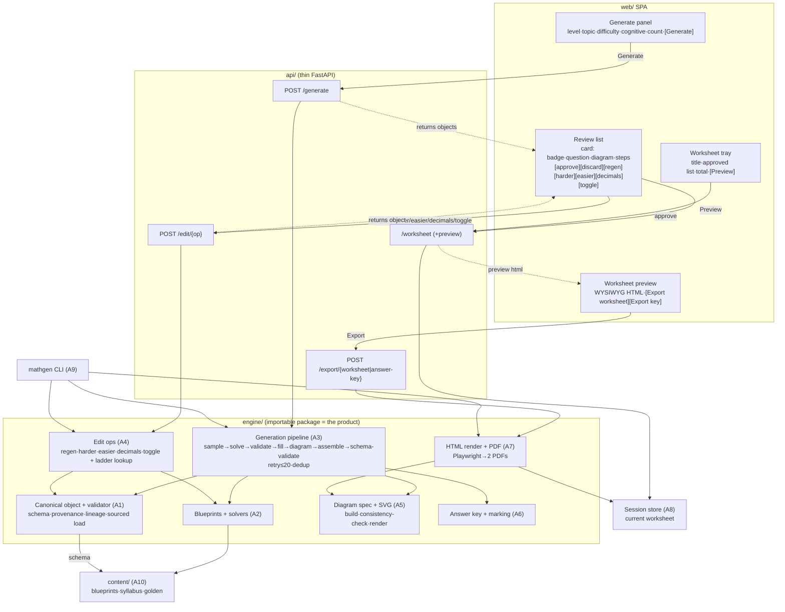

# Exam Paper Synthesis — Shaping

> **Where this sits:** the problem space is defined (`docs/background/REQS.md`, `docs/background/QUESTIONS.md`)
> and the solution is largely decided (`docs/adr/0001…0015`, synthesized in
> `docs/PRD.md`). This doc formalizes the requirements as a negotiated **R set**,
> records the decided architecture as the **selected shape (A)**, and runs the
> **fit check**. From here we breadboard **A** into affordances and slice it.
>
> **Ground-truth sources:** `docs/PRD.md` (user stories + decisions),
> `docs/adr/*`, `docs/SCHEMA.md`, `docs/DIFFICULTY.md`, `docs/CONTEXT.md` (glossary).

---

## Frame

- **Source** (verbatim): `docs/background/chatgpt-conversation-summary.md`, `docs/background/REQS.md`.
- **Problem:** A P5–P6 tuition teacher preparing Standard-Math practice spends
  hours writing questions, drawing figures, working out answers, and laying out a
  matching answer key — and the maths (the part that matters most) is the part
  most likely to carry a silent mistake. Existing tools either recycle a fixed
  static bank (repeats, can't nudge harder/easier) or lean on an LLM (confident,
  wrong maths and mismatched diagrams). **One wrong answer key destroys trust in
  the whole tool.**
- **Outcome:** In minutes, produce 20–50 fresh, syllabus-aligned questions the
  teacher trusts enough to hand out — each with a correct, step-by-step answer key
  and a diagram that matches the question — with a human veto before anything ships.

---

## Requirements (R)

Statuses: **Core goal** · **Must-have** · **Nice-to-have** · **Out** · **Undecided**.
R states *what's needed*; whether the shape satisfies it is shown in the Fit Check.

### R0 — Core goal · *Core goal*

Deterministic, blueprint-driven engine that generates syllabus-aligned Singapore
**P5–P6 Standard** math questions with correct step-by-step answer keys and
accurate diagrams, human-vetoed before output. The **canonical question object**
is the single source of truth; **no LLM in v1**. Single-user, self-serve.

### R1 — Select & generate

| ID | Requirement | Status |
|----|-------------|--------|
| R1.1 | Choose **level** (P5/P6), **topic**, and **difficulty** for the questions generated | Must-have |
| R1.2 | Choose **cognitive level** (routine-procedural / complex-familiar / non-routine-heuristic), not just difficulty | Must-have |
| R1.3 | Generate from an **approved blueprint**, not free-form AI (trust by construction) | Must-have |
| R1.4 | Each generation is a **fresh instance** with different numbers; **seeded & reproducible** | Must-have |
| R1.5 | Generate **several questions** for one topic/difficulty in a single batch | Must-have |
| R1.6 | Questions are recognisably **Singapore/PSLE style**, incl. non-routine multi-step word problems | Must-have |
| R1.7 | **Multi-part** questions: shared stem with parts a/b/c that build on each other | Must-have |

### R2 — Answer keys, marking & worked solutions

| ID | Requirement | Status |
|----|-------------|--------|
| R2.1 | Every question carries a **final answer** | Must-have |
| R2.2 | **Typed answers with correct units** (`cm²`, `$`, fractions, ratios) from a controlled unit vocabulary | Must-have |
| R2.3 | **Step-by-step worked solutions** per part | Must-have |
| R2.4 | **Marks per part** rendered as `[n]` on the worksheet | Must-have |
| R2.5 | Optional **detailed answer-key mode** showing M/A/B breakdown (M/A/B always stored on the object) | Nice-to-have |
| R2.6 | **Bar model embedded in the worked solution** for ratio/fraction/percentage | Must-have |
| R2.7 | The printed answer is provably **the actual solution to the printed question** (correctness by construction, golden-fixture tested) | Must-have |

### R3 — Diagrams

| ID | Requirement | Status |
|----|-------------|--------|
| R3.1 | Geometry questions always come with an **accurate mandatory figure** (the figure *is* the question) | Must-have |
| R3.2 | **Toggleable bar-model aid** on ratio/fraction/percentage | Must-have |
| R3.3 | Every label/dimension in a diagram **matches the question's numbers exactly** (consistency check) | Must-have |
| R3.4 | Diagrams are **crisp when printed** (deterministic spec → inline SVG) | Must-have |

### R4 — Review gate & fixed edit operations

| ID | Requirement | Status |
|----|-------------|--------|
| R4.1 | Show each question's **validation status/badge** before use | Must-have |
| R4.2 | **Approve / regenerate / discard** per question — human has the final say | Must-have |
| R4.3 | **Regenerate** with new numbers at the same difficulty | Must-have |
| R4.4 | **Make harder / easier** by swapping the sibling blueprint one rung up/down; **hidden at ladder ends** | Must-have |
| R4.5 | **Change to decimals** (representation transform on the current object) | Must-have |
| R4.6 | **Toggle diagram**, only where a diagram is optional (aid families); hidden for mandatory / no-diagram families | Must-have |
| R4.7 | Every edit yields a **new versioned object linked to its parent** (never mutate) | Must-have |
| R4.8 | On repeated generation failure, a **clear message rather than a hang** | Must-have |

### R5 — Worksheet assembly & export

| ID | Requirement | Status |
|----|-------------|--------|
| R5.1 | Collect approved questions into a **session-scoped current worksheet** | Must-have |
| R5.2 | **Preview** the worksheet as it will print (WYSIWYG) | Must-have |
| R5.3 | Export a **worksheet PDF**: numbered questions, `[n]` marks, answer spaces, mandatory diagrams, header (title, name/date, total marks) | Must-have |
| R5.4 | Export a **separate answer-key PDF**: final answers, worked steps, embedded aid diagrams, optional M/A/B | Must-have |
| R5.5 | Printed output **matches the on-screen preview** (one HTML/CSS pipeline) | Must-have |

### R6 — Canonical schema, validation & provenance (interchange-grade)

| ID | Requirement | Status |
|----|-------------|--------|
| R6.1 | Every object — **generated or sourced** — validates against **one versioned canonical JSON Schema** | Must-have |
| R6.2 | Invalid objects **rejected on load with path-pointed errors**; objects are **closed** (`additionalProperties:false`) | Must-have |
| R6.3 | **Sourced** questions (no blueprint/params, `source`+`license`, raster diagram) load through the **same schema** | Must-have |
| R6.4 | The app **can pull an alternative from the internal bank** when swapping (retrieval permitted; ingestion out of scope) | Nice-to-have |
| R6.5 | Every object records **provenance** (created-by engine vs ingested, `llm_used`, parent lineage, version) | Must-have |

### R7 — Blueprint authoring & engine correctness

| ID | Requirement | Status |
|----|-------------|--------|
| R7.1 | Blueprint = **YAML data + named Python solver** (`sample`/`solve`/`validate`/optional `diagram`) | Must-have |
| R7.2 | Each blueprint declares a **parameter schema**; sampled params are validated against it | Must-have |
| R7.3 | **Golden fixtures** (`params → expected answer/marks`), hand-verified, per blueprint | Must-have |
| R7.4 | **Deterministic seeded pipeline** (sample→solve→validate→fill→diagram→assemble→schema-validate); retry ≤ 20 then structured error; flag blueprints failing > 50% | Must-have |
| R7.5 | A thin **`mathgen` CLI** over the engine (headless generate/edit/export) | Must-have |
| R7.6 | The **engine is an importable package** the API and CLI both call (one implementation) | Must-have |

### R8 — Architecture & scope constraints

| ID | Requirement | Status |
|----|-------------|--------|
| R8.1 | **Monorepo, 4 layers**: `engine/`, `api/`, `web/`, `content/`; tooling **uv** + **pytest** | Must-have |
| R8.2 | **Engine is the product; API is thin** (FastAPI); web is **Svelte + Vite SPA**; **synchronous HTTP** in v1 | Must-have |
| R8.3 | **Single-user, self-serve, ephemeral** (session-scoped worksheet); no auth/accounts/tenancy | Must-have |
| R8.4 | **MVP = 15 blueprints** (3-rung ladder × 5 topics: Ratio, Fractions, Percentage, Area/Geometry, Speed); **Ratio ladder built end-to-end first** | Must-have |
| R8.5 | **Excluded in v1**: any LLM, ingestion/OCR tooling, schema redesign, free-text NL edits | Out |
| R8.6 | **Acceptance (L3)**: the full Ratio ladder drives the whole flow end-to-end → export **both** PDFs | Must-have |

---

## Shape A — Deterministic blueprint engine on a canonical-object seam

The one decided approach (ADR-0001…0015). Parts are **vertical slices** that
co-locate mechanism with the data it owns; layer boundaries (engine/api/web) are
in A9 rather than being their own horizontal parts.

| Part | Mechanism | Flag |
|------|-----------|:----:|
| **A1** | **Canonical object seam** — load/validate/serialize the canonical question object against `schemas/canonical-question.schema.json`; versioning (`schema_version`), closed objects, `source_type`-conditional requirements, provenance & lineage. *(R6)* | |
| **A2** | **Blueprint + solver framework** — YAML blueprint loader; declared parameter-schema validation; solver plugin interface (`sample`/`solve`/`validate`/optional `diagram`); golden-fixture harness. *(R7.1–R7.3)* | |
| **A3** | **Generation pipeline** — `generate(blueprint_code, seed)`: sample → solve → validate → fill templates → (optional) diagram spec → assemble → schema-validate; retry ≤ 20 → structured infeasible error; >50%-failure flag; in-session dedup by `(blueprint_code, seed)` + normalized-param hash. *(R1.3–R1.7, R7.4, R4.8)* | |
| **A4** | **Difficulty ladder + edit ops** — 3-rung topic ladders (author-declared difficulty + cognitive profile, `difficulty_levers[]`); edit transforms `regenerate` / `make-harder` / `make-easier` (sibling-rung swap) / `change-to-decimals` / `toggle-diagram`, each object→object, re-validated, `parent_id` set + `version` bumped. *(R1.1–R1.2, R4.3–R4.7)* | |
| **A5** | **Diagram spec + SVG render** — `diagram(params,solution)` → structured spec (`bar_model` / `composite_geometry` / `area_perimeter` / `shaded_fraction` / `raster`); per-family diagram-consistency check; spec → inline SVG. *(R3)* | |
| **A6** | **Answer key & marking** — typed `answer` (unit vocab), ordered **M/A/B** `marking_scheme`, per-part `solution_steps`; `[n]` on worksheet, M/A/B in detailed mode. *(R2)* | |
| **A7** | **HTML render + PDF export** — `render_worksheet_html` / `render_answer_key_html` as pure functions of approved objects; KaTeX + inline SVG + print CSS; HTML → headless Chromium (Playwright) → **two PDFs** (worksheet + answer key). *(R5.2–R5.5)* | |
| **A8** | **Session state + review gate** — session-scoped current-worksheet store of approved objects; per-question validation badge; approve / regenerate / discard; export from approved set only. *(R4.1–R4.2, R5.1)* | |
| **A9** | **Delivery layers** — engine as importable package; thin FastAPI over it (synchronous, schema-valid JSON); Svelte + Vite SPA; `mathgen` CLI sharing the engine. *(R7.5–R7.6, R8.1–R8.3)* | |
| **A10** | **Content & scope** — `content/syllabus/*.yaml` + `content/blueprints/*.yaml`; 15 blueprints (3×5); Ratio ladder authored end-to-end first as the L3 acceptance path. *(R8.4, R8.6)* | |

No parts flagged ⚠️ — every mechanism is concretely specified by an accepted ADR.

---

## Fit Check — R × A (selected shape)

Only top-level rows with a satisfaction judgement are shown; R0 is the core goal.

| Req | Requirement | Status | A |
|-----|-------------|--------|:-:|
| R1.1 | Choose level / topic / difficulty | Must-have | ✅ |
| R1.2 | Choose cognitive level | Must-have | ✅ |
| R1.3 | Generate from approved blueprint, not AI | Must-have | ✅ |
| R1.4 | Fresh, seeded, reproducible instances | Must-have | ✅ |
| R1.5 | Batch generation | Must-have | ✅ |
| R1.6 | Singapore/PSLE style incl. non-routine | Must-have | ✅ |
| R1.7 | Multi-part questions | Must-have | ✅ |
| R2.1 | Final answer on every question | Must-have | ✅ |
| R2.2 | Typed answers with correct units | Must-have | ✅ |
| R2.3 | Step-by-step worked solutions | Must-have | ✅ |
| R2.4 | `[n]` marks per part | Must-have | ✅ |
| R2.5 | Detailed M/A/B answer-key mode | Nice-to-have | ✅ |
| R2.6 | Bar model in worked solution | Must-have | ✅ |
| R2.7 | Answer provably matches question | Must-have | ✅ |
| R3.1 | Mandatory accurate geometry figure | Must-have | ✅ |
| R3.2 | Toggleable bar-model aid | Must-have | ✅ |
| R3.3 | Diagram labels match numbers exactly | Must-have | ✅ |
| R3.4 | Crisp-when-printed diagrams | Must-have | ✅ |
| R4.1 | Validation badge before use | Must-have | ✅ |
| R4.2 | Approve / regenerate / discard | Must-have | ✅ |
| R4.3 | Regenerate at same difficulty | Must-have | ✅ |
| R4.4 | Make harder/easier; hidden at ends | Must-have | ✅ |
| R4.5 | Change to decimals | Must-have | ✅ |
| R4.6 | Toggle diagram only where optional | Must-have | ✅ |
| R4.7 | Edits create linked new version | Must-have | ✅ |
| R4.8 | Clear failure message, no hang | Must-have | ✅ |
| R5.1 | Session-scoped current worksheet | Must-have | ✅ |
| R5.2 | WYSIWYG preview | Must-have | ✅ |
| R5.3 | Worksheet PDF | Must-have | ✅ |
| R5.4 | Separate answer-key PDF | Must-have | ✅ |
| R5.5 | Print matches preview | Must-have | ✅ |
| R6.1 | One versioned canonical schema | Must-have | ✅ |
| R6.2 | Reject invalid with path-pointed errors | Must-have | ✅ |
| R6.3 | Sourced questions load through same schema | Must-have | ✅ |
| R6.4 | Pull alternative from internal bank on swap | Nice-to-have | ❌ |
| R6.5 | Provenance recorded | Must-have | ✅ |
| R7.1 | Blueprint = YAML + Python solver | Must-have | ✅ |
| R7.2 | Declared parameter schema, validated | Must-have | ✅ |
| R7.3 | Golden fixtures per blueprint | Must-have | ✅ |
| R7.4 | Deterministic pipeline + retry/flag | Must-have | ✅ |
| R7.5 | `mathgen` CLI | Must-have | ✅ |
| R7.6 | Engine importable, one implementation | Must-have | ✅ |
| R8.1 | Monorepo, 4 layers, uv + pytest | Must-have | ✅ |
| R8.2 | Thin API, Svelte SPA, sync HTTP | Must-have | ✅ |
| R8.3 | Single-user, ephemeral, no auth | Must-have | ✅ |
| R8.4 | 15 blueprints; Ratio first | Must-have | ✅ |
| R8.5 | LLM / ingestion / schema-redesign / NL edits excluded | Out | ✅ |
| R8.6 | L3 acceptance: Ratio ladder end-to-end → both PDFs | Must-have | ✅ |

**Notes:**
- **R6.4 (❌)** — v1 wiring of bank-retrieval on swap is optional (ADR-0015 open
  item). The schema and provenance *structurally* support sourced questions
  (R6.3 ✅), but no part of A actually queries a bank during a swap, so it fails
  the binary fit check. It is Nice-to-have, so this is an accepted gap, not a
  blocker. If it becomes Must-have, add a part to A4/A9 (bank query on
  make-harder/easier) and re-run.

**Unsolved after selection:** only **R6.4** (Nice-to-have, deferred). Every
Must-have is satisfied. Shape A is ready to **breadboard**.

---

## Detail A — Breadboard

Concrete affordances for Shape A and how they wire together. **The affordance
tables are the source of truth; the diagram renders them.** *Place* = a screen,
panel, or code module where affordances live. UI places are in `web/`; non-UI
places are in `api/`, `engine/`, `content/`. "Wires Out" names where acting on an
affordance leads. Shape-part tags (A1…A10) tie each affordance back to the parts.

### UI Affordances (`web/` SPA)

| Place | Affordance | Wires Out | Part |
|-------|-----------|-----------|:----:|
| **Generate panel** | Level select (P5/P6) | → sets *GenRequest* | A10 |
| **Generate panel** | Topic select (Ratio/Fractions/Percentage/Area-Geom/Speed) | → sets *GenRequest* → resolves blueprint family | A10 |
| **Generate panel** | Difficulty select (easy/medium/hard rung) | → sets *GenRequest* → resolves `blueprint_code` | A4, A10 |
| **Generate panel** | Cognitive-level select (routine / complex / non-routine) | → filters *GenRequest* blueprint choice | A4 |
| **Generate panel** | Batch-count input (how many) | → sets *GenRequest.count* | A3 |
| **Generate panel** | **Generate** button | → `POST /generate` → renders cards in **Review list** | A3 |
| **Review list** | Question card *(repeated per instance)* | → contains the affordances below | A8 |
| **Review list** | Validation badge (pass/fail status) | ← `canonical.validation` (read-only) | A1, A8 |
| **Review list** | Question display (stem + parts, `[n]` marks) | ← `canonical.parts[]`, `total_marks` | A6 |
| **Review list** | Diagram display (inline SVG) | ← `canonical.parts[].diagram` | A5 |
| **Review list** | Solution-steps display (per part) | ← `canonical.parts[].solution_steps` | A6 |
| **Review list** | Detailed-key toggle (show M/A/B) | → view-only expand of `marking_scheme` | A6 |
| **Review list** | **Approve** button | → `POST /worksheet` (add) → **Worksheet tray** | A8 |
| **Review list** | **Discard** button | → removes card (client-only) | A8 |
| **Review list** | **Regenerate** button | → `POST /edit/regenerate` → replaces card | A4 |
| **Review list** | **Make harder** button *(hidden at top rung)* | → `POST /edit/make-harder` → replaces card | A4 |
| **Review list** | **Make easier** button *(hidden at bottom rung)* | → `POST /edit/make-easier` → replaces card | A4 |
| **Review list** | **Change to decimals** button | → `POST /edit/change-decimals` → replaces card | A4 |
| **Review list** | **Toggle diagram** button *(aid families only)* | → `POST /edit/toggle-diagram` → replaces card | A4, A5 |
| **Review list** | Infeasible-error notice | ← structured error from generation pipeline | A3 |
| **Worksheet tray** | Worksheet-title field (editable) | → *Session.title* | A8 |
| **Worksheet tray** | Approved-question list (remove / reorder) | → *Session.items* | A8 |
| **Worksheet tray** | Total-marks display | ← derived from *Session.items* | A6, A8 |
| **Worksheet tray** | **Preview** button | → `GET /worksheet/preview` → **Worksheet preview** | A7 |
| **Worksheet preview** | Rendered worksheet HTML (WYSIWYG) | ← `render_worksheet_html(Session)` | A7 |
| **Worksheet preview** | **Export worksheet PDF** button | → `POST /export/worksheet` → file download | A7 |
| **Worksheet preview** | **Export answer-key PDF** button | → `POST /export/answer-key` → file download | A7 |

### Non-UI Affordances (`api/`, `engine/`, `content/`)

| Place | Affordance | Wires Out | Part |
|-------|-----------|-----------|:----:|
| **API** (`api/`, thin FastAPI) | `POST /generate` | → `engine.generate()` × count → returns schema-valid objects | A9 |
| **API** | `POST /edit/{op}` | → `engine.edit.<op>()` → returns new object | A9 |
| **API** | `POST /worksheet` / `GET /worksheet` | → **Session store** | A9 |
| **API** | `GET /worksheet/preview` | → `render_worksheet_html` | A9 |
| **API** | `POST /export/{worksheet\|answer-key}` | → renderer → PDF exporter | A9 |
| **Engine — pipeline** (A3) | `generate(blueprint_code, seed)` | → sample → solve → validate → fill → diagram → assemble → schema-validate | A2, A5, A6, A1 |
| **Engine — pipeline** | Retry loop (≤ 20) | → structured "infeasible constraints" error; > 50%-fail flag | A3 |
| **Engine — pipeline** | In-session dedup | → reject dup `(blueprint_code, seed)` / normalized-param hash | A3 |
| **Engine — blueprints** (A2) | Blueprint loader | ← `content/blueprints/*.yaml` | A2, A10 |
| **Engine — blueprints** | Parameter-schema validator | → validates sampled `parameters` | A2 |
| **Engine — blueprints** | Solver plugin (`sample`/`solve`/`validate`/`diagram`) | → answer + intermediates (+ diagram spec) | A2, A5 |
| **Engine — edits** (A4) | `regenerate` / `make-harder` / `make-easier` / `change-decimals` / `toggle-diagram` | → new object: `parent_id` set, `version++`, re-validated | A1, A4 |
| **Engine — edits** | Ladder sibling lookup | ← topic ladder (rung ± 1); returns null at ends → button hidden | A4, A10 |
| **Engine — canonical** (A1) | Schema loader + validator | ← `schemas/canonical-question.schema.json` → path-pointed errors | A1 |
| **Engine — canonical** | Provenance/lineage stamper | → `created_by`, `llm_used=false`, `parent_id`, `version`, `schema_version` | A1 |
| **Engine — canonical** | Sourced-object load path | → validates `source`+`license`, raster diagram, `created_by="ingested"` | A1 |
| **Engine — diagram** (A5) | Diagram-spec builder (per family) | → `bar_model`/`composite_geometry`/`area_perimeter`/`shaded_fraction`/`raster` | A5 |
| **Engine — diagram** | Consistency check | → assert every label/dim = param/solved value | A5 |
| **Engine — diagram** | Spec → inline SVG renderer | → SVG string embedded in canonical/HTML | A5 |
| **Engine — answer key** (A6) | Typed-answer + M/A/B + solution-steps builder | ← solver answer + intermediates | A6 |
| **Engine — render** (A7) | `render_worksheet_html` / `render_answer_key_html` | ← approved objects (pure fns); KaTeX + SVG + print CSS | A7 |
| **Engine — render** | HTML → Chromium (Playwright) PDF | → worksheet PDF + answer-key PDF | A7 |
| **Session store** (A8) | Current-worksheet state (title + approved objects) | ← ephemeral, session-scoped; feeds renderers | A8 |
| **Content** (A10) | `content/blueprints/*.yaml`, `content/syllabus/*.yaml`, `tests/golden/` | ← authored; read by blueprint loader + tests | A2, A10 |
| **CLI** (`mathgen`, A9) | `generate` / `edit` / `export` subcommands | → calls `engine` directly (bypasses API) | A9 |

### Wiring diagram

**Orthogonal concerns the breadboard reveals:**
- **Edit ops (A4) are independent of generation (A3)** — both just produce a
  canonical object; the Review list treats a regenerated and a freshly-generated
  card identically.
- **Renderers (A7) depend only on approved objects**, never on how they were
  produced — so sourced questions render through the same path with no new wiring.
- **Session store (A8) is the only stateful place**; everything else is a pure
  function, which is what makes the CLI a first-class client alongside the API.
