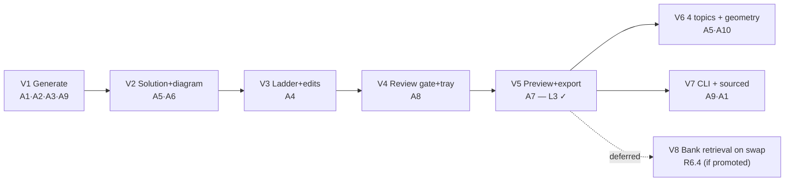

# Exam Paper Synthesis — Slices

> **Implementation plan** for Shape A (see `docs/shaping/SHAPING.md` for R, Shape A parts,
> fit check, and the breadboard this slices). Each slice is a **vertical
> increment** cutting through web → api → engine → content, and **ends in
> demo-able UI**. Order follows the ADR build directive: **prove the Ratio ladder
> end-to-end first**, then broaden.
>
> **Consistency:** slices reference Shape-A parts (A1…A10) and requirements
> (R1…R8). A change to a slice's scope must ripple up to `docs/shaping/SHAPING.md`.

---

## Slice map

| Slice | Title | Ends in (demo) | Parts | Reqs |
|-------|-------|----------------|-------|------|
| **V1** | Generate one Ratio question | Click **Generate** → a fresh, schema-valid Ratio question with its final answer + validation badge appears | A1, A2, A3, A9 | R1.3–R1.4, R2.1–R2.2, R6.1–R6.2, R6.5, R7.1–R7.4 |
| **V2** | Worked solution + marks + bar model | The card now shows worked steps, `[n]` marks, and an accurate bar-model SVG | A5, A6 | R2.3–R2.4, R2.6, R3.2–R3.4, R3.3 |
| **V3** | Ratio ladder + edit ops | Buttons on the card: **regenerate / make-harder / make-easier / change-decimals / toggle-diagram**, harder/easier hidden at ladder ends | A4 | R1.1–R1.2, R4.3–R4.8 |
| **V4** | Review gate + current worksheet | **Approve/discard** a card; approved questions collect in a titled worksheet tray with total marks | A8 | R4.1–R4.2, R5.1 |
| **V5** | Preview + export both PDFs | **Preview** matches print; **Export** yields a worksheet PDF and a separate answer-key PDF ⇒ **L3 acceptance (Ratio)** | A7 | R5.2–R5.5, R8.6 |
| **V6** | Remaining ladders + mandatory geometry | Topic selector fully live; geometry questions render mandatory composite/area/shaded figures | A5, A10 | R1.6, R3.1, R8.4 |
| **V7** | CLI + sourced-object interchange | `mathgen` generates/exports headlessly; a sourced past-paper object loads, validates, and renders through the same path | A1, A9 | R6.3, R7.5–R7.6 |

**Not sliced (deferred):** **R6.4** — pull an alternative from the internal bank
on swap (Nice-to-have, ADR-0015 open item). Add a slice V8 if it is promoted to
Must-have.

---

## V1 — Generate one Ratio question

**Goal:** the thinnest full-stack path that produces a trustworthy question.

**Affordances (subset of Detail A):**
- UI: Generate panel with topic/difficulty pinned to **Ratio / medium** (other
  selectors stubbed), **Generate** button; one Review-list card showing question
  text, final typed answer, and a validation badge.
- Non-UI: `POST /generate` → `engine.generate("ratio_medium", seed)`; blueprint
  loader + Ratio-medium solver (`sample`/`solve`/`validate`); canonical validator;
  provenance stamp.

**Build:**
1. **A1** canonical object + JSON-Schema validator + provenance stamping (schema
   already exists in `schemas/`; this wires load/validate/serialize).
2. **A2** blueprint loader + parameter-schema validation + solver interface; one
   `ratio_medium` blueprint YAML + solver; **golden fixtures** for it.
3. **A3** `generate(blueprint_code, seed)` pipeline with retry≤20 + structured
   error; in-session dedup.
4. **A9** thin `POST /generate`; minimal Svelte page with Generate button.

**Demo / acceptance:** click Generate repeatedly → different valid Ratio
questions each with a correct final answer; corrupt the solver and see the golden
fixture fail. Primary test seam: `generate("ratio_medium", seed)` → schema-valid
object with expected answer type/value/unit/marks.

## V2 — Worked solution + marks + bar model

**Goal:** make the answer *explainable* and add the aid diagram.

**Affordances:** card gains solution-steps display, `[n]` marks per part, and an
inline bar-model SVG. Detailed-key toggle (M/A/B) present.

**Build:** **A6** typed answer + ordered M/A/B `marking_scheme` + `solution_steps`
from solver intermediates; **A5** `bar_model` spec builder + consistency check +
spec→SVG renderer.

**Demo / acceptance:** the Ratio card shows worked steps, marks, and a bar model
whose units equal the ratio units; a deliberately corrupted spec is rejected by
the consistency check.

## V3 — Ratio ladder + edit operations

**Goal:** the teacher can nudge a question without leaving it.

**Affordances:** regenerate / make-harder / make-easier / change-to-decimals /
toggle-diagram buttons; harder/easier hidden at rung ends; toggle only on the
(aid-family) Ratio card.

**Build:** author the **full Ratio ladder** (`ratio_easy`, `ratio_medium`,
`ratio_hard`) + fixtures; **A4** edit transforms as object→object (each sets
`parent_id`, bumps `version`, re-validates) + ladder sibling lookup;
`POST /edit/{op}`.

**Demo / acceptance:** make-harder on medium → hard rung; make-harder on hard →
button absent; change-to-decimals alters answer representation only; every edit
produces a new object linked to its parent.

## V4 — Review gate + current worksheet

**Goal:** the human veto and the collection surface.

**Affordances:** approve / discard on each card; Worksheet tray with editable
title, approved-question list (remove/reorder), total-marks display.

**Build:** **A8** session-scoped current-worksheet store **held client-side in the
SPA (Svelte store) — no server state**; approve/discard handlers; tray UI (editable
title, up/down reorder, remove, total-marks = sum of `question.total_marks`, dedup by
id). Approved cards show an "Added" state with their gate/edit actions disabled.
Export (V5) receives the approved set from the client.

**Demo / acceptance:** approve several Ratio questions across rungs → they appear
in the tray with correct total marks; discard removes a card without persisting.

## V5 — Preview + export both PDFs  *(completes L3 for Ratio)*

**Goal:** trustworthy printable output, WYSIWYG.

**Affordances:** Worksheet preview (rendered HTML); Export worksheet PDF; Export
answer-key PDF.

**Build:** **A7** `render_worksheet_html` / `render_answer_key_html` (pure fns of
approved objects; KaTeX + inline SVG + print CSS: single column, numbered Qs,
right-aligned `[n]`, answer spaces, header); HTML → Chromium (Playwright) → two
PDFs; `POST /export/{preview|worksheet|answer-key}` receiving `{title, questions}`
from the client worksheet store.

**Demo / acceptance (L3):** full Ratio ladder → generate across all 3 rungs →
apply each edit op → approve at the gate → export a worksheet PDF **and** a
separate answer-key PDF; preview matches print. PDF export smoke-tested
(non-empty); renderers asserted on structure/content.

## V6 — Remaining ladders + mandatory geometry

> **Shipped (2026-07-17), split into V6 + V6b:** the geometry half of V6 grew into its own richer,
> syllabus-grounded track — **V6b** — after shaping with the product owner. V6
> now = Fractions / Percentage / Speed + the `shaded_fraction` figure; **V6b** =
> the `geometry_angle` + `geometry_area` ladders on a general `geometry_figure`
> system (superseding the sketched `composite_geometry` / `area_perimeter`
> families). See **`docs/shaping/V6b-geometry-plan.md`**.

**Goal:** the other four topics, including the figure-is-the-question families.

**Affordances:** topic selector fully live (all 5 topics × 3 rungs); geometry
cards render mandatory (non-toggleable) figures.

**Build:** **A5** `composite_geometry` / `area_perimeter` / `shaded_fraction` spec
builders + consistency checks; **A10** 12 more blueprints (Fractions, Percentage,
Area/Geometry, Speed) + solvers + golden fixtures; diagram policy (mandatory vs
aid) per family.

**Demo / acceptance:** each topic generates end-to-end; geometry questions always
carry an accurate figure and offer no diagram toggle; aid families still toggle.

## V7 — CLI + sourced-object interchange

> **Shipped (2026-07-17):** the final MVP slice. `mathgen` CLI (KAN-152, PR #69)
> and sourced-object interchange (KAN-153, PR #70). See
> **`docs/shaping/V7-plan.md`** for the full blueprint.

**Goal:** headless engine access and interchange-grade schema proof.

**Affordances:** `mathgen generate/edit/export` subcommands; sourced-object load
path (no blueprint/params, `source`+`license`, raster diagram,
`created_by="ingested"`).

**Build:** **A9** `mathgen` CLI calling the engine directly (its own `_pdf.py`
Chromium boundary; depends only on `exam-engine`, never FastAPI — the
engine-agnostic proof); **A1** sourced load path exercised end-to-end. The
canonical *load/validate/worksheet-join* path was genuinely unchanged (the export
route already load-gates every object), but **raster *rendering* needed a small
new branch** — `render_svg`/`renderDiagram` raised/returned-empty on
`type:"raster"` — so V7 wired a `raster` `` renderer (Python + TS mirror).
(Corrects this plan's earlier "no new wiring" assumption.) V7 also surfaced that
`question.stem` was silently dropped by the worksheet renderer — needed for
multi-part sourced questions — and fixed it (inert for single-part generated
questions).

**Demo / acceptance:** `mathgen` generates and exports both PDFs with no web app;
a hand-authored sourced past-paper object validates, joins a worksheet, and
renders (raster figure included) alongside generated questions in both the
worksheet and answer-key.

---

## Sliced breadboard (build order overlay)

V1–V5 are a strict chain (each needs the prior). **V6 and V7 both depend only on
V5** and are independent of each other — they can be built in parallel once the
Ratio path proves the model.
