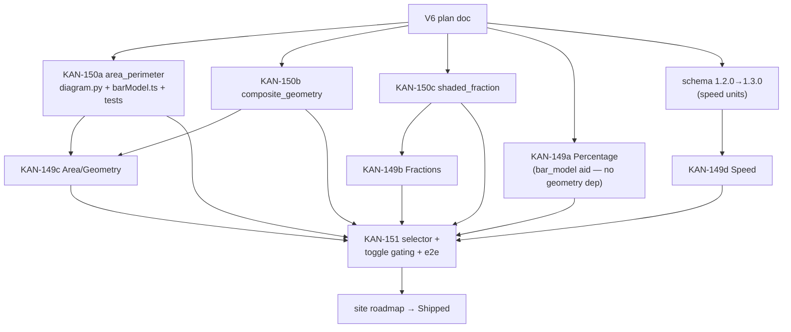

# V6 Slice Plan — Remaining ladders + mandatory geometry

> **Slice V6 of `docs/shaping/SLICES.md`.** Broaden from the single Ratio topic to
> **all five MVP topics**, and introduce the **mandatory-figure** families where
> *the figure is the question*. Ground truth for R and Shape A:
> `docs/shaping/SHAPING.md` (parts **A5** = diagram spec+check+render, **A10** =
> content & scope; requirements **R1.6** Singapore/PSLE-style incl. non-routine,
> **R3.1** mandatory accurate geometry figure, **R8.4** 15 blueprints = 3-rung
> ladder × 5 topics). Difficulty model: `docs/DIFFICULTY.md` + **ADR-0015**.
> Diagram policy (aid vs mandatory, per family): **ADR-0007**; diagram union:
> **ADR-0012**; diagram-consistency + schema versioning: **ADR-0014**. Blueprint =
> YAML + named solver: **ADR-0003**; answer key + M/A/B marks: **ADR-0005**;
> engine-purity / JSON-Schema-as-truth: **ADR-0016**.
>
> **Schema contract:** `schemas/canonical-question.schema.json` is **v1.2.0**. The
> three geometry `diagram.type` values (`composite_geometry`, `area_perimeter`,
> `shaded_fraction`) and every answer variant V6 needs are **already declared**
> (see "Schema impact"). The *only* proposed change is additive **speed units** in
> the `unit` enum → **v1.2.0 → v1.3.0** (minor, backward-compatible). If the
> Speed ladder can avoid a compound-unit answer, even this bump disappears.
>
> **Demo goal:** the Generate panel's topic + difficulty selectors go **fully
> live** (5 topics × 3 rungs). Generating any topic yields a fresh, schema-valid
> question with a correct typed answer and per-part `[n]` marks. **Geometry
> questions always render an accurate mandatory figure and offer NO diagram
> toggle**; the aid families (ratio / fraction-word-problem / percentage) still
> render a toggleable bar model. make-harder / make-easier walk each topic's own
> ladder; the button is hidden at the ends.

---

## The shaping decisions this slice locks in

1. **The four new topics and what each rung tests (from `docs/DIFFICULTY.md`).**
   Each rung deliberately pulls the difficulty levers named in
   `cognitive.difficulty_levers[]`; marks follow the Ratio precedent
   (easy **2**, medium **3**, hard **4** — the *composition* lever, DIFFICULTY §1).

   | Topic (code prefix) | easy | medium | hard | Diagram family |
   |---|---|---|---|---|
   | **Fractions** (`fractions_*`) | Fraction of a shaded figure — read the fraction off a partitioned shape *(proposed; see D1)* | Fraction of a **remainder** (2-step) | Successive fractions of a remainder; **unknown whole** (inverse) | easy = **`shaded_fraction`** (mandatory); medium/hard = **`bar_model`** (aid) |
   | **Percentage** (`percentage_*`) | X% of a number | Percentage increase / decrease | **Reverse %** (original before change) | **`bar_model`** (aid) all three |
   | **Area/Geometry** (`area_*`) | Area of a rectangle | **Composite** figure (add/subtract rectangles) | Overlapping figures / **missing dimension given the area** (inverse) | easy = **`area_perimeter`**; medium/hard = **`composite_geometry`** (both mandatory) |
   | **Speed** (`speed_*`) | `d = s × t` (direct) | Average speed over two legs | Meeting / overtaking; before-after speed change | **none** (no figure family in scope; see D4) |

   Levers per rung mirror DIFFICULTY.md's table: easy = `Reasoning depth` /
   `Representation translation` (routine_procedural); medium adds `Reasoning
   depth` + `Number type` (complex_familiar); hard pulls `Direction` (inverse) +
   `Hidden structure` + `Reasoning depth` (non_routine_heuristic) — exactly the
   pattern `ratio_hard` already encodes.

2. **Aid (toggleable) vs mandatory (non-toggleable) is decided by `diagram.type`,
   not by topic (ADR-0007).** This is a lock-in because it fixes a real gap in the
   current engine (see the KAN-151 build note):
   - **Aid types** (`toggle-diagram` available): `bar_model`,
     `bar_model_before_after`.
   - **Mandatory types** (`toggle-diagram` **hidden/absent**): `composite_geometry`,
     `area_perimeter`, `shaded_fraction` — the figure *is* the question (R3.1).
   - A topic may mix tiers (proposed **Fractions**: mandatory `shaded_fraction`
     easy rung, aid `bar_model` medium/hard) — which is *why* the gate must key on
     the diagram type, not the topic. This is the first slice that exercises the
     "toggle hidden" path (deferred from V3, plan D3 there).

3. **No schema bump for diagrams; one minor additive bump for Speed units.**
   `schemas/canonical-question.schema.json` v1.2.0 already ships
   `diagram_composite_geometry`, `diagram_area_perimeter`, `diagram_shaded_fraction`
   (and `raster`) as closed `$def`s in the `diagram` oneOf (ADR-0012). All V6
   diagram work is *code* (consistency check + SVG renderer), not *schema*. The
   answer union already covers `fraction` (Fractions), `quantity` with `%`
   (Percentage), `quantity` with `cm^2`/`m^2` (Area). The **only** schema gap is a
   **speed answer unit** — the `unit` enum has `km`, `m`, `h`, `min`, `s` but **no
   `km/h` / `m/s` / `m/min`**. Adding them is additive and backward-compatible →
   **`SCHEMA_VERSION` 1.2.0 → 1.3.0** (`schema.json` enum + `canonical.py` +
   `docs/SCHEMA.md`). See D3 for the escape hatch that avoids it.

4. **Blueprint-code convention:** `<topic>_<rung>`, matching `ratio_{easy,medium,hard}`.
   The web selector resolves `(topic, difficulty)` → `f"{prefix}_{rung}"`
   client-side; the engine already loads `content/blueprints/<code>.yaml` by code.

5. **Speed ships without a diagram (D4).** DIFFICULTY.md's Speed ladder is
   word-problem-based and ADR-0007 lists no Speed figure family; a journey
   `number_line` is explicitly a *future* ADR-0012 variant, out of scope. Speed
   blueprints declare no `diagram:` and expose no `diagram()` method — so, like the
   original V1 solvers, `build_part_diagram` returns `None` and no toggle appears.

---

## Scope

**In:**

**(A10 / KAN-149) Twelve new blueprints — four topics × three rungs.** Each is
authored to the letter of the Ratio template: a `content/blueprints/<code>.yaml`
(`code`, `syllabus`, `cognitive` incl. `difficulty` + `difficulty_levers`, `marks`,
`parameter_schema`, `story_templates`, `solution_template`, `marking_scheme`,
`answer`, optional `diagram`), a solver class in
`engine/exam_engine/blueprints/solvers/<code>.py` (`sample`/`solve`/`validate`,
`diagram` only where a figure applies) **registered by name**, and a hand-verified
`tests/golden/<code>.jsonl` (R7.3 — never model-verified). Constraints satisfied
**by construction** (ADR-0014) so `validate` never rejects a well-formed sample.
Plus four new `content/syllabus/<topic>.yaml` files paralleling `ratio.yaml`, and
four new ladders in `engine/exam_engine/ladder.py`.

**(A5 / KAN-150) Three mandatory-figure diagram families.** For each of
`composite_geometry`, `area_perimeter`, `shaded_fraction`: a `check_consistency`
branch + a `render_svg` branch in `engine/exam_engine/diagram.py` (dispatched on
`spec["type"]`, exactly like `bar_model` / `bar_model_before_after` today), and a
**mirror client renderer** so the live review card shows the figure (the SPA
renders from the spec, `web/src/lib/barModel.ts`, not from server SVG — see the
KAN-151 note). No schema change — the `$def`s exist.

**(KAN-151) Topic selector live + toggle gating.** Generate-panel topic + difficulty
selects (5×3) driving `blueprint_code`; `edits.available_ops` + `QuestionCard`
toggle-diagram gated on the **aid diagram-type set** so geometry cards never offer
it; geometry cards render their mandatory figure.

**Explicitly deferred (do NOT build here):**
- `mathgen` CLI + sourced-object load path → **V7** (the renderers/checks V6 adds
  are reused there unchanged).
- New diagram families beyond the three (`number_line`, `cumulative_frequency`,
  volume/cuboid) — ADR-0012 "future" list, out of scope.
- Cognitive-level and batch-count selectors (breadboard affordances) — optional;
  `count` is already wired end-to-end, so it can ride along, but it is not required
  for V6 acceptance. Cognitive-level filtering is deferred.
- Generalising `change-to-decimals` beyond money (e.g. fraction→decimal) — see D5.
- Bank retrieval on swap (R6.4) → deferred (V8 if promoted).

---

## Schema impact

**Confirmed present in v1.2.0 (no change needed):**

- `diagram` oneOf already contains **`diagram_composite_geometry`** (`unit`,
  `shapes[]` each `{id, kind∈{rectangle,square}, x, y, width, height, label?}`,
  optional `shaded {op∈{intersection,union,difference}, of[]}`),
  **`diagram_area_perimeter`** (`unit`, `shape {kind∈{rectangle,square,triangle,l_shape},
  dims{}}`), and **`diagram_shaded_fraction`** (`shape∈{rectangle,circle,bar}`,
  `total_parts`, `shaded_parts`) — all closed (`additionalProperties:false`),
  `type` pinned via `const` (ADR-0012). See `schemas/canonical-question.schema.json`
  lines 317–374 and `docs/SCHEMA.md` Example 2.
- `answer` oneOf already covers `fraction` (`numerator`/`denominator`/`mixed`),
  `quantity` (`value`+`unit`), `integer`, `decimal`. Area answers use
  `quantity`+`cm^2`/`m^2` (both in the `unit` enum); Percentage uses `quantity`+`%`
  or `decimal`; Fractions use `fraction`.
- `cognitive.difficulty` enum already has `easy`/`medium`/`hard`;
  `difficulty_levers[]` already exists.

**One proposed additive change (v1.2.0 → v1.3.0):** extend the `unit` enum
(`$defs.unit`, currently line 138–142) with the speed units the Speed ladder needs:
add **`"km/h"`, `"m/s"`, `"m/min"`**. Backward-compatible (existing objects still
validate). Touch points, mirroring V3's 1.1.0→1.2.0 bump: the enum in
`schemas/canonical-question.schema.json`; `SCHEMA_VERSION` in
`engine/exam_engine/canonical.py` (line 18); the `unit` list in `docs/SCHEMA.md`;
and the `1.2.0` references in `CLAUDE.md`. Every generated object still passes
`canonical.load` (the A1 gate). *(If D3's escape hatch is taken, skip this bump.)*

---

## Files touched

```
docs/shaping/V6-plan.md                                     # NEW — this plan
docs/shaping/SLICES.md / SHAPING.md                         # only if scope shifts (D1/D3/D4 outcomes)
docs/ROADMAP.md                                             # M6 stories → sub-cards + status on merge
docs/DIFFICULTY.md                                          # only if D1 accepted (Fractions-easy cell note)

# (A5) mandatory-figure diagram families — KAN-150
engine/exam_engine/diagram.py                               # + check_ + render_ branches for the 3 types
web/src/lib/barModel.ts                                     # + client mirror renderers (or NEW geometry.ts)
tests/test_diagram_composite_geometry.py                    # NEW  consistency valid/corrupt + SVG smoke + determinism
tests/test_diagram_area_perimeter.py                        # NEW
tests/test_diagram_shaded_fraction.py                       # NEW

# (A10) 12 blueprints — KAN-149 (split into 4 topic cards; see breakdown)
content/syllabus/{fractions,percentage,area,speed}.yaml     # NEW ×4
content/blueprints/fractions_{easy,medium,hard}.yaml        # NEW ×3
content/blueprints/percentage_{easy,medium,hard}.yaml       # NEW ×3
content/blueprints/area_{easy,medium,hard}.yaml             # NEW ×3
content/blueprints/speed_{easy,medium,hard}.yaml            # NEW ×3
engine/exam_engine/blueprints/solvers/{fractions,percentage,area,speed}_{easy,medium,hard}.py  # NEW ×12
engine/exam_engine/blueprints/solvers/__init__.py           # import the 12 new solver modules
engine/exam_engine/ladder.py                                # + 4 ladders in LADDERS
tests/golden/{fractions,percentage,area,speed}_{easy,medium,hard}.jsonl  # NEW ×12 (hand-verified)
tests/test_generate_<code>.py                               # NEW per blueprint (mirror test_generate_ratio_*)
tests/test_ladder.py                                        # + sibling assertions for the 4 new ladders

# schema bump (folded into the Speed card; could be its own 1-pt card)
schemas/canonical-question.schema.json                      # + km/h, m/s, m/min in unit enum (1.3.0)
engine/exam_engine/canonical.py                             # SCHEMA_VERSION 1.2.0 → 1.3.0
docs/SCHEMA.md                                              # document the added units + 1.3.0

# (KAN-151) selector + toggle gating
engine/exam_engine/edits.py                                 # available_ops: gate toggle on AID diagram types
web/src/App.svelte                                          # topic + difficulty selects → blueprint_code (replace pinned panel)
web/src/lib/QuestionCard.svelte                             # canToggleDiagram → aid-family gate
web/src/lib/types.ts                                        # DiagramSpec union widened (via barModel.ts) if geometry types added there
tests/test_edits.py                                         # + toggle NOT available on geometry; available on fraction bar_model rungs
tests/e2e/*.spec.js                                         # + a geometry topic path (figure present, no toggle)

# if V6 ships
site/index.html                                             # roadmap V6 → Shipped; status chip
```

---

## (A10) The twelve blueprints — solver contract

Every solver implements the `Solver` protocol from
`engine/exam_engine/blueprints/base.py` (`sample(schema, rng) -> params`,
`solve(params) -> {answer, intermediates}`, `validate(params, solution) ->
{ok, checks}`, optional `diagram(params, solution) -> spec`) and calls
`register("<code>", <Solver>())` at import (added to `solvers/__init__.py`). The
pipeline (`pipeline.run_pipeline`) samples → validates params against the blueprint
`parameter_schema` → solves → validates → builds the diagram (if any) → runs
`diagram.check_consistency` → `canonical.assemble` → schema-validates, with retry
≤ 20 (`MAX_ATTEMPTS`). `intermediates` feed the `solution_template` steps (via
`canonical._fill`); `marking_scheme` marks must sum to `marks` (enforced in
`assemble`). Solvers that scale money for `change-to-decimals` set a `MONEY_KEYS`
class attribute (as `RatioMediumSolver` does); Speed/Area/Fraction solvers with no
`$` answer simply omit it (that op is then naturally unavailable — D5).

Below, the by-construction sampling that keeps every answer a clean value.

### Fractions (`fractions_*`)

- **`fractions_easy` — shaded figure (mandatory `shaded_fraction`).** *(proposed —
  D1.)* "What fraction of the figure is shaded?" `sample`: `total_parts ∈ [2,12]`,
  `shaded_parts ∈ [1, total_parts-1]`, shape ∈ {rectangle, bar}. `solve`: answer
  `{type: fraction, numerator: shaded_parts, denominator: total_parts}` (store the
  unreduced read-off; reduction can be a later rung). `diagram`: `{type:
  "shaded_fraction", shape, total_parts, shaded_parts}` — **mandatory, no toggle.**
  `validate`: `parts_in_range`, `answer_matches_shading`. marks **2**,
  `routine_procedural`, levers `["Representation translation"]`.
- **`fractions_medium` — fraction of a remainder (bar_model aid).** e.g. "A had $N.
  He spent a/b of it, then c/d of the remainder on X. How much was X?" `sample`
  picks unit-friendly fractions and an `N` divisible by the denominators *by
  construction* so every stage is an integer. answer `quantity` (`$`/`items`).
  `diagram`: `bar_model` (aid, toggleable). marks **3**, `complex_familiar`, levers
  `["Reasoning depth","Number type / magnitude"]`.
- **`fractions_hard` — successive fractions, unknown whole (inverse, bar_model
  aid).** Work-backwards: given the final quantity after successive fraction
  removals, find the original whole. Construct the whole so all stages divide
  evenly; answer is that whole. marks **4**, `non_routine_heuristic`, levers
  `["Direction","Hidden structure","Reasoning depth"]`.

### Percentage (`percentage_*`) — bar_model aid throughout

- **easy** "Find X% of $N." `sample`: `pct ∈ {5,10,…,90}`, `N` divisible so
  `N*pct/100` is integer. answer `quantity` `$` (or `%`). marks **2**, routine.
- **medium** percentage increase/decrease of a base. answer `quantity` `$`. marks
  **3**, complex_familiar, levers `["Reasoning depth","Number type / magnitude"]`.
- **hard** reverse % — given the value *after* an X% change, find the original.
  Inverse + hidden structure; construct originals that stay integer. marks **4**,
  non_routine, levers `["Direction","Hidden structure","Reasoning depth"]`.

### Area/Geometry (`area_*`) — mandatory figures, no toggle

- **easy** area of a rectangle. `sample`: `w,h ∈ [2,20]`. answer `quantity` `cm^2`.
  `diagram`: `{type:"area_perimeter", unit:"cm", shape:{kind:"rectangle",
  dims:{width, height}}}`. marks **2**, routine, levers `["Representation
  translation"]`.
- **medium** composite (two rectangles, add/subtract). answer `cm^2`. `diagram`:
  `{type:"composite_geometry", unit:"cm", shapes:[…], shaded:{op:"union"|
  "difference", of:[…]}}`. marks **3**, complex_familiar.
- **hard** overlapping figures / missing dimension given the area (inverse).
  `diagram`: `composite_geometry` (op `intersection` for overlap; or an
  `area_perimeter` with an unknown dimension labelled). marks **4**, non_routine,
  levers `["Direction","Hidden structure"]`. *(Overlap intersection matches
  `docs/SCHEMA.md` Example 2 exactly.)*

### Speed (`speed_*`) — no diagram

- **easy** `d = s × t` direct. Sample integer `s,t`; answer either `distance`
  (`quantity` `km`/`m`) **or** `speed` (`quantity` `km/h`). marks **2**, routine.
- **medium** average speed over two legs: `avg = total_distance / total_time`.
  Construct legs so the average is a clean value. answer `quantity` **`km/h`**
  (needs 1.3.0). marks **3**, complex_familiar, levers `["Reasoning depth","Answer
  form"]`.
- **hard** meeting/overtaking or before-after speed change (relative speed).
  answer `quantity` (`km/h` or `km` or `h`). marks **4**, non_routine, levers
  `["Direction","Hidden structure","Cross-topic integration"]`.

> **If a rung can express its answer with an existing unit** (e.g. always ask for
> *distance* in `km`, or *time* in `h`, never *speed*), the 1.3.0 bump is
> avoidable (D3). At least one natural Speed rung asks for a speed, so the plan
> assumes the bump; the human can decide.

---

## (A5) The three mandatory-figure diagram families

> **⚠️ SUPERSEDED (2026-07-17).** Two of these three families —
> `composite_geometry` and `area_perimeter` — are **replaced** by the richer,
> syllabus-grounded **`geometry_figure`** system shaped in
> **`docs/shaping/V6b-geometry-plan.md`** (epic **M6b** / EPIC-39: the
> `geometry_angle` + `geometry_area` ladders). They are removed from the schema
> (v1.3.0) before being built. **Only `shaded_fraction` survives here**, as the
> Fractions-easy mandatory figure (D1). The subsection below is retained for
> historical context; build `shaded_fraction` per KAN-150 and everything else per
> the V6b blueprint.

Each family follows `diagram.py`'s existing two-function contract, dispatched on
`spec["type"]`:

- **`check_consistency`** (called by `pipeline.run_pipeline`, R3.3): a
  `check_<type>_consistency(spec, params, solution) -> dict[str,bool]` returning a
  per-check boolean map. Every labelled dimension/part in the spec must equal the
  corresponding param or solved value; a deliberately corrupted spec must flip a
  check to `False` (which raises `DiagramInconsistent` in the pipeline — a
  deterministic figure from correct values is always consistent, so a real failure
  is an engine bug, surfaced loudly). Add the three branches to the existing
  `check_consistency` dispatcher (currently `bar_model` / `bar_model_before_after`,
  lines 20–27) — do NOT touch the two existing branches.
- **`render_svg`** (used by the V5 export path via
  `engine.render.render_worksheet_html` → `diagram.render_svg`, and mirrored
  client-side for the live card): a `_render_<type>(spec) -> str` returning a
  self-contained inline `<svg>` (explicit `viewBox`, **integer coordinates**, no
  external refs), added to the `render_svg` dispatcher (lines 130–137). Pure +
  deterministic — the same discipline as `_render_bar_model`.

Per family (checks are illustrative; author fixes exact set):

| Type | Consistency checks | SVG |
|---|---|---|
| `area_perimeter` | `shape.dims` == solver dims; `unit` matches; labelled edge lengths == params | one rectangle/triangle/L-shape with edge-length labels |
| `composite_geometry` | each shape's `x,y,width,height` == params; `shaded.of` ids exist; `shaded.op` matches the solved region | overlaid rectangles at integer scale; shaded region filled per `op` |
| `shaded_fraction` | `total_parts` == denominator; `shaded_parts` == numerator; `shape` matches | a shape partitioned into `total_parts` equal cells, `shaded_parts` filled |

**Client mirror (important architectural note).** The canonical object stores the
diagram **spec**, and the live review card renders it **client-side** via
`web/src/lib/barModel.ts:renderDiagram` (which today returns `''` for any type it
doesn't know — so a geometry card would show **no figure**, which is unacceptable
for a mandatory-figure family). So each geometry family needs a **TypeScript mirror
renderer** (extend `barModel.ts` or add `geometry.ts`, and widen the `DiagramSpec`
union), mirroring the Python renderer the same way `renderBarModelBeforeAfter`
mirrors `_render_bar_model_before_after`. This is real work and is the reason the
web geometry rendering is called out explicitly (see Risks R2 and the card
breakdown — it may sit in KAN-150 per-family or in KAN-151).

---

## (KAN-151) Topic selector + aid/mandatory toggle gating

**Engine gate (the correctness fix).** Today `edits.available_ops`
(`engine/exam_engine/edits.py`, lines 52–53) adds `toggle-diagram` iff
`load_blueprint(code).diagram is not None`. Because geometry blueprints **do**
declare a diagram (mandatory), that logic would wrongly offer a toggle. Change it
to gate on the **aid diagram-type set** — note `BlueprintSpec.diagram` holds the
YAML `diagram:` **string** (e.g. `"bar_model"`, `"composite_geometry"`):

```python
AID_DIAGRAM_TYPES = {"bar_model", "bar_model_before_after"}
...
if load_blueprint(code).diagram in AID_DIAGRAM_TYPES:
    ops.add("toggle-diagram")
```

This makes `toggle-diagram` available on ratio (all rungs), fractions medium/hard,
and percentage; **absent** on `area_*`, and on `fractions_easy` (mandatory
`shaded_fraction`). The `_toggle_diagram` transform itself is unchanged.

**Web selector.** Replace the pinned panel in `web/src/App.svelte` (currently
`generate('ratio_medium', 1)`, lines 19/56–64) with a **topic** select
(Ratio/Fractions/Percentage/Area-Geometry/Speed) and a **difficulty** select
(easy/medium/hard), resolving `blueprint_code = ${prefix}_${rung}` and calling the
existing `generate(blueprintCode, count)` (`web/src/lib/api.ts`). `types.ts`
already has `Difficulty`. No API change — `POST /generate` already takes any
`blueprint_code`.

**Web toggle gate.** `QuestionCard.svelte`'s `canToggleDiagram` is currently
`q.blueprint_code?.startsWith('ratio')` (line 27). Replace with an aid-family test
mirroring the engine — simplest robust form: a small `AID_BLUEPRINT_PREFIXES`
set-membership (`ratio`, `percentage`, plus the fraction *word-problem* rungs
`fractions_medium`/`fractions_hard`), or gate on the present spec's type ∈
`{bar_model, bar_model_before_after}` when a diagram is showing. Server stays the
real guard (422 on a disallowed op); the client gate is purely for button
visibility.

---

## Proposed card breakdown / sequencing

KAN-149 (13 pts) is too coarse for one PR/review. Recommended cut: **one card per
topic** (each = 3 rungs + solvers + goldens + syllabus + ladder entry + per-rung
tests → an independently reviewable PR), **one card per geometry diagram family**
under KAN-150, and KAN-151 as-is. All under **EPIC-31**. `story_points` are
estimates for grooming.

| Proposed title | Pts | Epic | Depends on | Own PR? |
|---|---:|---|---|---|
| V6 slice plan doc (`docs/shaping/V6-plan.md`) | 2 | 31 | — | yes (this deliverable) |
| **KAN-150a** Diagram family: `area_perimeter` (engine check+render, web mirror, tests) | 3 | 31 | plan | yes |
| **KAN-150b** Diagram family: `composite_geometry` (engine check+render, web mirror, tests) | 3 | 31 | plan | yes |
| **KAN-150c** Diagram family: `shaded_fraction` (engine check+render, web mirror, tests) | 2 | 31 | plan | yes |
| **KAN-149a** Blueprint topic: **Percentage** (3 rungs, bar_model aid, solvers, goldens, ladder) | 3 | 31 | plan (reuses `bar_model`) | yes |
| **KAN-149b** Blueprint topic: **Fractions** (3 rungs, mixed shaded_fraction + bar_model, solvers, goldens, ladder) | 3 | 31 | **KAN-150c** (shaded_fraction) | yes |
| **KAN-149c** Blueprint topic: **Area/Geometry** (3 rungs, mandatory figures, solvers, goldens, ladder) | 4 | 31 | **KAN-150a + KAN-150b** | yes |
| **KAN-149d** Blueprint topic: **Speed** (3 rungs, no diagram, solvers, goldens, ladder) **+ schema 1.2.0→1.3.0 speed units** | 4 | 31 | plan (schema bump self-contained) | yes |
| **KAN-151** Web: live topic×rung selector + aid/mandatory toggle gating (`edits.available_ops` + `QuestionCard` + `App.svelte`) + e2e geometry path | 5 | 31 | all four topic cards + all three geometry web mirrors | yes |
| Site roadmap flip V6 → Shipped | 1 | 31 | KAN-151 merged | yes (final) |

Notes for the PM:
- **The four topic cards are the split of KAN-149** (≈13 pts total: 3+3+4+4=14).
  Percentage is lightest (pure `bar_model` reuse); Area/Geometry and Speed are
  heaviest (mandatory figures / schema bump).
- **The three geometry-family cards are the split of KAN-150** (2+3+3=8 pts,
  matching its estimate). Each is a full vertical for one diagram type: engine
  `check_consistency` + `render_svg` branch **and** the web mirror renderer, so the
  topic card that consumes it can both generate (engine) and display (web).
- **Serialization risk:** KAN-150a/b/c all edit `engine/exam_engine/diagram.py`
  (disjoint functions, but the same file) and `web/src/lib/barModel.ts` — build in
  worktrees, and the integrator resolves the additive merges (new branch in each
  dispatcher). Same one-line-merge situation as V3's `solvers/__init__.py`.
- **The schema bump** (1.2.0→1.3.0) is folded into the Speed card because only Speed
  needs it; it touches shared files (`schema.json`, `canonical.py`) so if two topic
  cards are in flight simultaneously, pull it out as its own 1-pt prerequisite card
  to avoid a version-string merge race.

---

## Build order & dependencies



- **Parallel (disjoint content files):** the three geometry-family cards, and
  Percentage (needs no geometry) — can start immediately after the plan. Each new
  blueprint lives in its own YAML + solver module + golden file; the only shared
  engine edits are `solvers/__init__.py` (one import line each) and `ladder.py`
  (one `LADDERS` entry each) — trivial additive merges.
- **Must serialize:** the schema bump (shared `schema.json` + `canonical.py`
  version string); each geometry-consuming topic card **after** its diagram
  family (`pipeline.run_pipeline` calls `check_consistency`, which raises
  `ValueError` for a type with no branch — so the Area card cannot generate until
  `composite_geometry`/`area_perimeter` checks exist). KAN-151 is last: it needs
  every topic to exist and every geometry web-mirror to render.

---

## Demo / acceptance (from SLICES V6)

**Done when:**
1. `uv run pytest` green — all V1–V5 tests **plus** a `test_generate_<code>` per new
   blueprint and the three geometry diagram tests. `make py-lint` / `py-fmt` /
   `py-typecheck` green over the 12 new solver modules + `diagram.py`.
2. `npm --prefix web run build`, `lint`, `check`, `test:unit` green; `e2e` extended
   with a geometry path passes.
3. In the browser: pick any of the **five topics** × **three rungs** → Generate →
   a fresh schema-valid card with the right typed answer + `[n]` marks;
   **make-harder/easier** walk that topic's ladder and hide at the ends;
   **Area/Geometry** and **Fractions-easy** cards show an accurate figure and have
   **no** toggle button; ratio / percentage / fractions-word-problem cards still
   toggle their bar model.
4. Site roadmap M6/V6 flips to **Shipped** (only after merge).

**Concrete test seams:**
- `generate("area_medium", seed)` → schema-valid; `answer.type=="quantity"`,
  `unit=="cm^2"`; `parts[0].diagram.type=="composite_geometry"`;
  `validation.checks["diagram_consistent"] is True`; `total_marks==3`;
  deterministic (same seed → identical object); golden `params → answer/marks`.
- `generate("speed_medium", seed)` → `answer.unit=="km/h"` (requires **1.3.0**),
  `total_marks==3`.
- `generate("fractions_easy", seed)` → `answer.type=="fraction"`,
  `diagram.type=="shaded_fraction"`, `shaded_parts==numerator`,
  `total_parts==denominator`.
- **Corrupted geometry spec** (e.g. mutate a `composite_geometry` shape's
  `width`) → its `check_<type>_consistency` flips a check to `False`; in the
  pipeline this raises `DiagramInconsistent`; `render_svg` smoke: starts `<svg`,
  contains the labelled dimensions, deterministic.
- `available_ops`: `"toggle-diagram" not in available_ops(area_obj)`;
  `"toggle-diagram" in available_ops(fractions_medium_obj)`;
  `"toggle-diagram" not in available_ops(fractions_easy_obj)`.
- `ladder.sibling`: `sibling("area_easy",-1) is None`, `sibling("area_easy",+1)=="area_medium"`,
  `sibling("speed_hard",+1) is None`, for all four new ladders.
- **Hand-verified golden per new blueprint** in `tests/golden/*.jsonl` (R7.3).

---

## Risks / open questions

- **R1 — Deterministic sampling for the harder rungs.** Reverse-% (Percentage
  hard), unknown-whole (Fractions hard), missing-dimension-given-area (Area hard),
  and meeting/overtaking (Speed hard) must produce clean integer answers *by
  construction* (ADR-0014), like `ratio_hard`'s LCM construction. If naive sampling
  fails > 50% it trips the retry-budget flag (R7.4). Mitigation: construct
  backwards from the answer (pick the whole/original first, derive the givens), the
  same technique `ratio_hard.sample` uses.
- **R2 — Geometry figure rendering complexity (both sides).** `composite_geometry`
  (overlapping rectangles, shaded intersection/union/difference at integer scale)
  is the hardest SVG. It must be authored **twice** — Python (`diagram.py`, for the
  PDF export path) and TypeScript (`barModel.ts`, for the live card) — kept in
  lockstep, exactly like the two bar-model renderers today. This roughly doubles
  KAN-150's rendering effort and is the main reason the web mirror is flagged.
- **R3 — `shaded_fraction`'s home / the Fractions-easy cell (D1).** DIFFICULTY.md's
  Fractions-easy cell is "fraction of a quantity" (a bar-model word problem), but
  the only natural home for the mandatory `shaded_fraction` family is a Fractions
  shaded-figure rung. The plan **proposes** making Fractions-easy the shaded-figure
  question (see D1); the human should confirm, since it edits DIFFICULTY.md.
- **R4 — Speed answer unit → schema bump.** Adding `km/h`/`m/s`/`m/min` is trivial
  and additive, but it is a schema version change (1.3.0) with the usual multi-file
  ripple. Avoidable only if every Speed rung asks for distance/time, not speed
  (D3) — a content decision.
- **R5 — Twelve new modules through the quality gates.** ruff (`E,F,I,UP,B,SIM`,
  line-length 100) and mypy over 12 solvers + `diagram.py` additions; budget for it.
  Reuse the shared `NAME_POOL` / helper pattern to keep them uniform.
- **R6 — `change-to-decimals` on non-money topics (D5).** The current op is
  money-specific (÷10, gated on `answer.unit=="$"` + `MONEY_KEYS`). On Area/Speed
  (no `$`) it is simply unavailable — acceptable degradation. Generalising it to
  fraction→decimal is a distinct feature; deferred unless the human wants it.

---

## Decisions / notes

- **D1 — Fractions-easy uses the mandatory `shaded_fraction` figure (proposed).**
  Gives the third geometry family a natural home and lets one topic exercise both
  diagram tiers (mandatory easy, aid medium/hard), which is the cleanest way to
  demo the aid-vs-mandatory gate. Cost: a one-line note in `docs/DIFFICULTY.md`'s
  Fractions-easy cell. **Alternative:** keep DIFFICULTY.md verbatim (all Fractions
  rungs are bar_model aid word problems) and build `shaded_fraction` but leave it
  unused by any V6 blueprint — wasteful and it wouldn't be exercised end-to-end.
  **Recommend D1.** *Human decision.*
- **D2 — Aid vs mandatory is keyed on `diagram.type`, not topic.** Locked in because
  it fixes the `available_ops` gap and supports mixed-tier topics (D1). Aid set =
  `{bar_model, bar_model_before_after}`; everything else mandatory.
- **D3 — One minor additive schema bump (1.3.0) for speed units, unless avoided.**
  The diagram `$def`s already exist, so this is the *only* schema change, and only
  if a Speed rung answers in speed. *Human decision on whether to keep speed-unit
  answers.*
- **D4 — Speed ships without a diagram.** No Speed figure family is in scope
  (ADR-0007 lists none; `number_line` is a future ADR-0012 variant). Speed solvers
  omit `diagram()`; no toggle appears.
- **D5 — `change-to-decimals` stays money-only.** Naturally unavailable on
  non-money topics; generalisation deferred (R6).
- **D6 — Blueprint codes follow `<topic>_<rung>`; ladders are explicit data.**
  Extend `ladder.py:LADDERS` with `Fractions`/`Percentage`/`Area`/`Speed` keys
  (the V3 plan's D5 flagged this exact extension). `ladder_for` already scans by
  membership, so the key strings are cosmetic — blueprint codes drive siblings.

---

## Doc-consistency checklist (ripple on merge)

- `docs/shaping/SLICES.md` — V6 row already present; update only if D1/D3/D4 shift
  scope.
- `docs/shaping/SHAPING.md` — parts A5/A10 already cover this; no change unless
  scope shifts.
- `docs/ROADMAP.md` — M6 currently lists 3 todo stories; replace with the split
  sub-cards above and flip statuses as PRs merge; update the board-summary counts.
- `docs/SCHEMA.md` — **if D3 accepted:** add the speed units to the `unit` list and
  bump the stated version to 1.3.0.
- `docs/DIFFICULTY.md` — **if D1 accepted:** note the Fractions-easy shaded-figure
  framing.
- `docs/CONTEXT.md` — glossary already defines aid vs mandatory and the topic list;
  no change needed (optionally add the four new syllabus files to any file
  inventory).
- `CLAUDE.md` — **if D3 accepted:** update the `schema … (currently v1.2.0)`
  references to v1.3.0; note the four new topics are live (currently says "through
  slice V5, Ratio only").
- `site/index.html` — V6 → Shipped + status chip, final PR only after merge.
