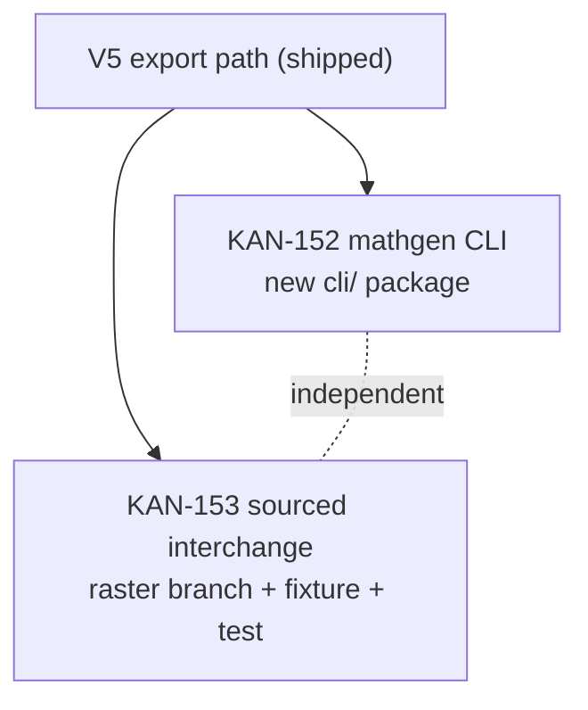

# V7 Blueprint — CLI + sourced-object interchange (the final MVP slice)

> **Implementation plan for Slice V7** (`docs/shaping/SLICES.md`, parts **A9**
> headless engine access + **A1** canonical load path). V7 is the *last* MVP slice
> and, unlike V1–V6b, ships **no new maths** — it proves two properties the earlier
> slices *asserted* but never exercised end-to-end:
>
> 1. **The engine is genuinely UI/HTTP-agnostic** (ADR-0016 / CLAUDE.md purity
>    rule). A `mathgen` command-line tool drives `generate` / `edit` / `export`
>    through the *same* pure functions the API calls — with no FastAPI, no web app,
>    no browser except at the one impure PDF boundary.
> 2. **The canonical object is interchange-grade** (ADR-0004/0016). A hand-authored
>    *sourced* past-paper question — `source_type:"sourced"`, no blueprint/params, a
>    citation `source`+`license`, a raster diagram, `created_by:"ingested"` —
>    validates against the **same** `schemas/canonical-question.schema.json`, joins a
>    worksheet next to generated questions, and renders in preview/PDF.
>
> **Two independent vertical slices**, both depending only on V5 (the export path)
> and disjoint from each other (see §Build order) — so they build in parallel and
> land one at a time.
>
> **Reference ground truth (verified against the code, not the docs — CLAUDE.md):**
> engine surface `engine/exam_engine/{pipeline,edits,canonical,render,diagram}.py`;
> the impure PDF boundary `api/app/export.py::html_to_pdf`; the export route
> `api/app/routes_export.py` (the load-gate precedent); schema
> `schemas/canonical-question.schema.json` **v1.3.0** (unchanged by V7 — the hooks
> already exist). ADRs: engine purity / schema-as-truth **0016**; sourced provenance
> **0004**; diagram union **0012**; PDF boundary **0008/0010**; blueprint = YAML +
> solver **0003**; answer key + M/A/B **0005**.
>
> **Demo goal:** `mathgen generate geometry_area_hard --seed 7 --out q.json` writes
> a schema-valid question with no web app running; `mathgen export worksheet
> --title "Term 3 Review" q.json sourced.json --out ws.pdf` writes a worksheet PDF
> whose pages carry **both** an engine-generated question *and* a hand-authored
> sourced past-paper question (raster figure included), from a single headless
> command.

---

## What already exists vs. what V7 adds (grounding — verified in code)

V7's headline is "exercise the hooks that already exist." That is **mostly** true,
with **one honest exception** the plan makes explicit rather than hand-waving.

| Capability V7 needs | State in `main` today | V7 work |
|---------------------|-----------------------|---------|
| Pure `generate(code, seed)` | ✅ `pipeline.py` (retry ≤20, dedup) | call it from the CLI |
| Pure `edits.apply(op, obj, seed)` + `available_ops` | ✅ `edits.py` | call it from the CLI |
| Load gate `canonical.load(obj)` (validate any object) | ✅ `canonical.py` — used by `/edit`, `/export` | call it from the CLI + on the sourced fixture |
| Pure HTML renderers `render_worksheet_html` / `render_answer_key_html` | ✅ `render.py` | call them from the CLI |
| Impure `html_to_pdf(html)` (headless Chromium) | ✅ `api/app/export.py` — **inside the `api` package** | the CLI needs a browser-PDF path **without** importing FastAPI (see **C1**) |
| Schema hooks for a sourced object (`source_type`, `source`, `license`, `provenance.created_by:"ingested"`, nullable `blueprint_code`/`parameters`, `$defs/diagram_raster`) | ✅ all present in **v1.3.0** (verified: the `allOf`/`if-then` requires `source`+`license` when `source_type:"sourced"`; `created_by` enum = `{engine, ingested}`) | author a fixture that uses them; **no schema change** |
| **Render a `diagram_raster`** (`type:"raster"`, `asset_ref`, `alt_text`) | ❌ **GAP.** `render.render_svg` raises `ValueError` on unknown types; there is **no `raster` branch**. The web mirror `barModel.ts::renderDiagram` returns `''` for unknown types. | **add a small `raster` branch** in the Python renderer **and** the TS mirror (see **S1**) |

> **Honesty note (ripples into `docs/shaping/SLICES.md`).** SLICES.md V7 currently
> says the renderers are "confirmed to handle a raster diagram … with **no new
> wiring**." That is **not true of `main`** — `render_svg` raises on `type:"raster"`.
> The *load/validate/worksheet-join* path is genuinely unchanged (the export route
> already `canonical.load`-gates every question dict, so a sourced object flows
> through untouched), but **raster *rendering* is a real — if tiny — new branch.**
> V7 adds it; the doc gets corrected to say so.

---

## Shaping decisions

| # | Decision | Choice | Rationale |
|---|----------|--------|-----------|
| **C1** | Where does the CLI's PDF (Chromium) code live, given the engine must stay browser-free and the CLI must **not** import FastAPI (else it undercuts "the engine is UI/HTTP-agnostic")? | **LOCKED (2026-07-17): New `cli/` workspace member (package `mathgen`) that depends only on `exam-engine` and owns a ~15-line `_pdf.py` Playwright helper** (the same shape as `api/app/export.py::html_to_pdf`). No change to `api/`. | Keeps the CLI decoupled (proves the point of the slice), keeps the two V7 cards on disjoint files (parallelism), needs no `api/` edits. Cost: ~15 lines of well-understood Playwright glue duplicated (tracked as R1). *Alternatives rejected:* (A) CLI depends on `exam-api` — drags the whole web framework into the CLI closure, contradicting the slice's purpose; (D) extract `html_to_pdf` into `exam-engine` as an optional `[pdf]` extra — most DRY but puts browser code in the engine tree and touches `engine/`+`api/`, breaking disjointness. |
| **C2** | CLI package name + entry point | package **`mathgen`**, console-script **`mathgen`** (`[project.scripts]`), stdlib **`argparse`** (no new runtime dep beyond Playwright), subcommands `generate` / `edit` / `export`. | Matches the ticket title; argparse keeps the dependency surface minimal (dev-playbook §13); `uv run mathgen …` works from the workspace. |
| **C3** | CLI I/O contract | JSON in / JSON out. `generate` → one canonical object (or `--count N` → a JSON array) to `--out` file or stdout; `edit <op>` reads an object from a file/stdin, applies the op, writes the child object; `export {preview\|worksheet\|answer-key}` reads **one or more** object files, writes `.html` (preview) or `.pdf`. Exit non-zero + a path-pointed message on validation failure (reuse `CanonicalValidationError`). | Unix-composable (`mathgen generate … \| mathgen edit make-harder -`), and every object crossing the boundary goes through `canonical.load` — the CLI can't emit an invalid object. |
| **S1** | How a raster diagram's image reaches the PDF (Chromium) and the web card | The fixture's `asset_ref` is a **self-contained `data:` URI** (base64 PNG); the renderer emits ``. | Consistent with the V5 "vendored self-contained, no CDN" precedent (KaTeX is inlined) — no filesystem asset resolution, no external fetch, the PDF stays a single self-contained document. A tiny placeholder PNG (e.g. a simple figure) keeps the fixture readable. **Alternative:** a repo-relative file path resolved to a `file://` URL — rejected: fragile across CWDs, not self-contained. |
| **S2** | The sourced fixture's shape | A realistic PSLE-style question: `source_type:"sourced"`, `blueprint_code:null`, `parameters:null`, `seed:null`, `source:{origin,year,paper,reference}`, `license:"…"`, `provenance:{created_by:"ingested", version:1, …}`, `question.parts[*]` with hand-authored `text` / `answer` / `marks` / `solution_steps`, and one part carrying the `diagram_raster`. Lives at `tests/fixtures/sourced/` and doubles as the demo asset. | It is simultaneously the **test fixture** and the **interchange proof** — per the project verification policy, the test *is* the proof (validate → worksheet → render), not a golden regression anchor. |

---

## KAN-152 — `mathgen` CLI over the engine (part A9)

**Goal:** a headless operator (or a script, or CI) can generate, edit, and export
questions with nothing but the engine + a browser — no web app, no API server.

**Package (per C1/C2):** new workspace member `cli/` → package `mathgen`:

```
cli/
  pyproject.toml            # name = "mathgen"; deps = ["exam-engine", "playwright>=…"]; [project.scripts] mathgen = "mathgen.__main__:main"
  mathgen/
    __init__.py
    __main__.py             # argparse wiring + dispatch; the ONLY entry point
    commands.py             # thin functions: cmd_generate / cmd_edit / cmd_export (pure marshalling over engine calls)
    _pdf.py                 # html_to_pdf(html) -> bytes  (the one impure Playwright boundary; mirror of api/app/export.py)
  tests/
    test_cli_generate.py
    test_cli_edit.py
    test_cli_export.py
```

Root `pyproject.toml`: add `"cli"` to `[tool.uv.workspace] members`.

**Subcommands (C3):**

| Command | Engine call | Output |
|---------|-------------|--------|
| `mathgen generate <code> [--seed N] [--count K] [--out f]` | `pipeline.generate(code, seed)` per item (fresh seeds for `--count`) | canonical object → JSON (array if `--count>1`); every object `canonical.load`-checked before write |
| `mathgen edit <op> [<file>\|-] [--seed N] [--out f]` | `edits.apply(op, obj, seed)`; `edits.available_ops(obj)` for a friendly error when the op is unavailable | child object (new `id`, `parent_id`, bumped `version`) → JSON |
| `mathgen export preview <files…> [--title T] [--out f]` | `render.render_worksheet_html(title, [load(q)…])` | HTML |
| `mathgen export worksheet <files…> [--title T] --out f.pdf` | `render_worksheet_html` → `_pdf.html_to_pdf` | worksheet PDF |
| `mathgen export answer-key <files…> [--title T] --out f.pdf` | `render_answer_key_html` → `_pdf.html_to_pdf` | answer-key PDF |

Every question path routes through `canonical.load` — the CLI marshals and guards;
it owns **no maths and no HTML**. `list`/`--help` enumerate the blueprint codes
(from the registry) so an operator can discover them.

**Tests (behavioural, end-to-end — not golden anchors):**
- `generate ratio_medium --seed 1` → stdout parses as JSON, `canonical.load` accepts
  it, `source_type=="generated"`, deterministic (same seed → same `id`/params).
- `generate --count 3` → a 3-element array, all schema-valid, deduped ids.
- `edit make-harder` on a medium object → a hard-rung child with `parent_id` set;
  `edit make-harder` on a hard object → non-zero exit + "op not available" (from
  `available_ops`), nothing written.
- `export worksheet` over two objects → output file begins with `%PDF-`, non-empty
  (PDF smoke, mirroring the V5 export test); `export preview` → HTML containing both
  stems. Run under `subprocess`/`CliRunner`-style invocation so it exercises the
  real argv path. (PDF tests require Chromium — gate/skip with the same marker the
  existing export test uses if Playwright isn't installed.)

**Non-goals:** no config files, no interactive mode, no bank/DB access, no new
edit ops — a *thin* wrapper (dev-playbook §10, small reversible slice).

---

## KAN-153 — sourced-object interchange (part A1)

**Goal:** demonstrate the canonical object is interchange-grade — a question the
engine did **not** generate loads, validates, and renders through the identical
path, with the minimum honest code (the raster render branch, S1).

**Work:**

1. **Author the sourced fixture** (S2) at `tests/fixtures/sourced/psle_*.json` —
   schema-valid by construction, `data:`-URI raster figure, hand-verified answer +
   M/A/B marks. Doubles as the `mathgen export` demo input.
2. **Add the `raster` render branch (S1) — the one real code addition:**
   - **Python** `engine/exam_engine/render.py` / `diagram.py`: `render_svg` (or the
     part-render step that calls it) gains a `type=="raster"` branch emitting
     `<figure class="diagram"></figure>`.
     (Decide the cleanest seam: a `type=="raster"` case in `render_svg` returning the
     ``, vs. handling raster in `render._render_part_head` before it reaches
     `render_svg`. Prefer the single dispatch point so the web mirror matches.)
   - **Web** `web/src/lib/barModel.ts` + `types.ts`: `renderDiagram` gains a
     `raster` case emitting the same ``; widen the `DiagramSpec` union with the
     raster shape. (So a sourced object dropped into the live tray — future — would
     also show its figure; keeps the Py/TS mirror invariant, ADR precedent.)
3. **The interchange test (the proof, not a regression anchor):**
   - `canonical.load(fixture)` succeeds (validates against the same v1.3.0 schema).
   - Negative controls: a copy missing `source`/`license` → rejected; a copy with
     `source_type:"sourced"` but a non-null `blueprint_code` still validates *only*
     if the schema allows it — assert the actual contract (the `if-then` only
     *requires* fields for each `source_type`; document what it does/doesn't forbid).
   - **Mixed worksheet:** `render_worksheet_html("Mixed", [generated_obj, sourced_obj])`
     and `render_answer_key_html(...)` both succeed; assert the sourced stem, its
     `` (raster), and the generated question all appear; the answer key shows
     the hand-authored sourced answer + marks; total marks = sum across both.
   - **PDF smoke:** the mixed worksheet renders to a `%PDF-` document (reuse the V5
     export smoke; via the API `/export` route or `mathgen export`, whichever the
     card lands after — see build order).

**Non-goals:** no ingestion pipeline, no OCR, no bank storage, no new schema
version, no web tray wiring for sourced objects (only the renderer mirror, so the
invariant holds) — V7 exercises the *object* and the *render path*, nothing more.

---

## Build order & dependencies



**Disjoint file sets → parallel build, serialized landing:**

- **KAN-152** touches: `cli/**` (new), root `pyproject.toml` (`members` list only).
- **KAN-153** touches: `engine/exam_engine/{render,diagram}.py`,
  `web/src/lib/{barModel,types}.ts`, `tests/fixtures/sourced/**`, a new test.
- **No shared file.** They can run as two concurrent worktree agents; **land one PR
  at a time** (review + merge), then `update-branch` the other, wait for CI, merge.
- **Sequence recommendation:** land **KAN-153 first** (adds the raster branch the
  CLI's `export` demo relies on to show the sourced figure), then **KAN-152**. Not a
  hard dependency — the CLI is testable without a sourced object — but landing 153
  first means the CLI's end-to-end demo (mixed worksheet PDF) works immediately.

---

## Demo / acceptance + test seams

- **Headless generate:** `uv run mathgen generate ratio_hard --seed 3` prints a
  schema-valid object; `--count 3 --out qs.json` writes a 3-element valid array.
- **Headless edit:** `mathgen edit make-easier qs.json` walks the ladder; at a rung
  end the op is refused with a clear message (from `available_ops`).
- **Headless export (the L-level proof):** `mathgen export worksheet --title
  "Review" generated.json sourced.json --out ws.pdf` and `… answer-key … --out
  ak.pdf` write two PDFs, from the CLI alone, whose pages carry **both** a generated
  question and the sourced past-paper question with its raster figure.
- **Interchange:** the sourced fixture `canonical.load`s clean; a mixed worksheet
  renders (HTML + PDF) with no generated-vs-sourced branch in the render path (only
  the shared raster case); the answer key prints the hand-authored sourced solution.
- **Engine-purity proof:** the CLI imports `exam_engine` + Playwright and **not**
  `fastapi`/`app` (assert with a grep/import test) — the slice's whole point.

---

## Risks / open questions

- **R1 — CLI/API PDF drift (from C1 duplication).** `cli/mathgen/_pdf.py` mirrors
  `api/app/export.py::html_to_pdf`. *Mitigation:* keep both to the same ~15-line
  shape; add a comment cross-reference; if drift ever bites, promote to C1-alt-D
  (shared `exam-engine[pdf]` extra). The KaTeX-done wait selector is the one subtle
  bit — copy it verbatim.
- **R2 — Playwright/Chromium in a third package.** The CLI needs the browser only
  for `export {worksheet,answer-key}`; `generate`/`edit`/`preview` don't.
  *Mitigation:* import Playwright lazily inside `_pdf.py` so non-PDF subcommands (and
  their tests) run with no browser; gate PDF tests on Chromium availability (V5
  precedent).
- **R3 — the "no new wiring" claim in SLICES.md is wrong for raster.** *Mitigation:*
  this plan corrects it (see §grounding) and the raster branch is in KAN-153's scope;
  the doc ripple is in the checklist.
- **R4 — sourced answer trust.** A sourced question's answer is hand-authored, not
  solver-proven — the "no LLM, provably correct" invariant applies only to
  *generated* questions. *Mitigation:* that is by design (ADR-0004: `created_by:
  "ingested"`, `llm_used` stays false because a human authored it); the fixture's
  answer is hand-verified and the test documents this boundary explicitly.
- **Q1 — CLI `export` I/O for `preview`:** file or stdout for HTML? *Proposed:*
  `--out` file, default stdout — same as `generate`. Confirm at review.

---

## Doc-consistency checklist (ripple on merge)

- `docs/shaping/SLICES.md` — V7 row: **correct** the "renderers handle raster with
  no new wiring" claim (raster rendering is a small new branch); mark V7 shipped.
- `docs/ROADMAP.md` — M7: mark KAN-152/153 done with PR numbers; move M7 to **done**.
- `CLAUDE.md` — overview: append V7 (CLI + sourced interchange) to the slice list;
  add the `cli/` workspace member to the repo-layout table + a "How to run" row
  (`uv run mathgen …`); bump the test count.
- `docs/SCHEMA.md` — add a short "sourced objects" worked example (the fixture) and
  document the `diagram_raster` render behaviour (now wired).
- `docs/CONTEXT.md` — glossary: `mathgen` CLI; sourced vs generated object.
- `docs/adr/` — consider a short ADR recording C1 (CLI PDF boundary lives in the CLI
  package, not the engine) if the team wants the decision captured.

---

## Proposed board structure — epic **M7 / EPIC-32** (cards already exist)

The two cards are already on the board; V7 executes them (this doc is the plan-doc
that V3/V5/V6b each had). Optionally add a plan-doc card for parity with prior
slices.

| Card | Pts | Depends on | Files (disjoint) |
|------|----:|------------|------------------|
| *(optional)* V7 plan doc (this file) | 1 | — | `docs/shaping/V7-plan.md` |
| **KAN-153** — sourced-object interchange: raster render branch (Py + TS) + sourced fixture + interchange test | 5→**3** | V5 | `engine/…/{render,diagram}.py`, `web/src/lib/{barModel,types}.ts`, `tests/fixtures/sourced/**` |
| **KAN-152** — `mathgen` CLI (`generate`/`edit`/`export`) as a new `cli/` workspace package + tests | 5 | V5 (soft: 153) | `cli/**`, root `pyproject.toml` |

> **Point size note:** KAN-153 reads as 3 pts once the finding lands — it is a fixture
> + a ~2-line render branch (×2 renderers) + one interchange test, not a subsystem.
> KAN-152 stays 5 (new package, three subcommands, Playwright wiring, three test
> files). Confirm at review.
